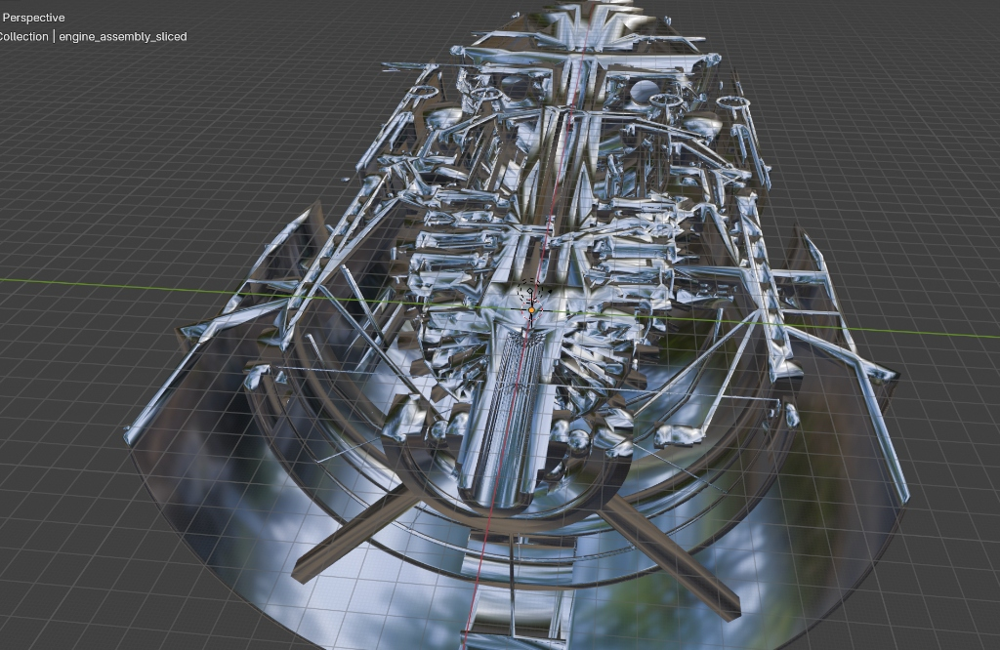
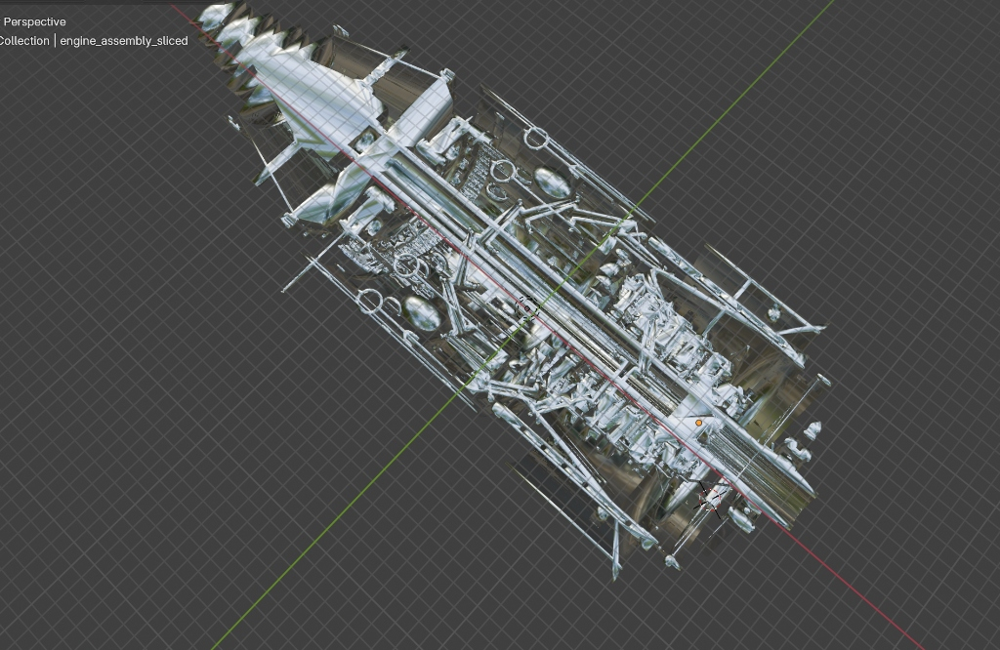
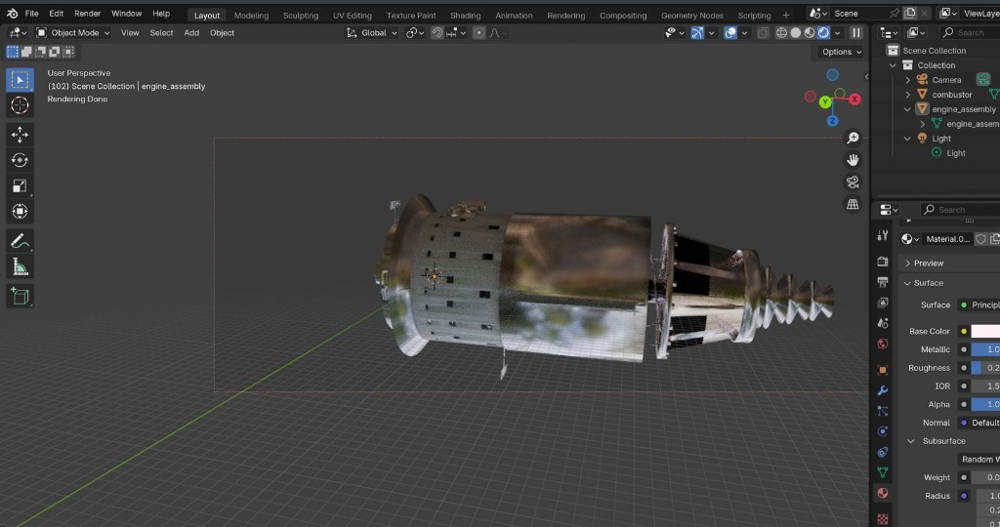
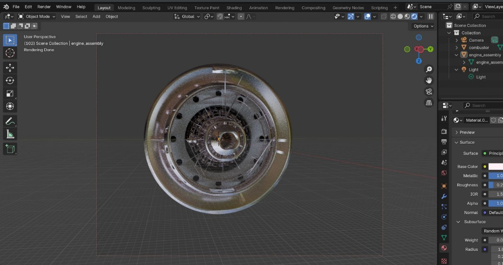
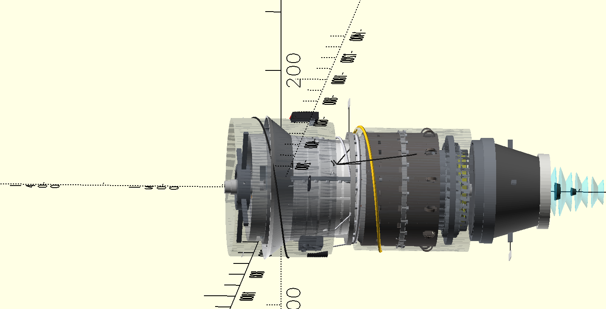
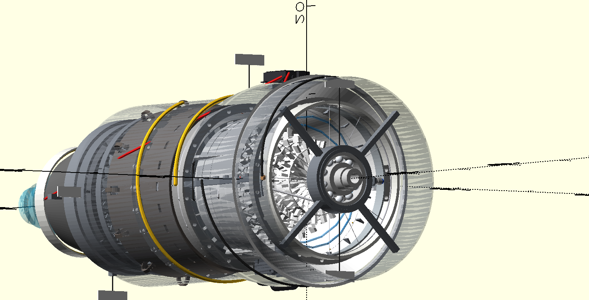

# AEGIS-TF1: Full Authority Digital Engine Control (FADEC) & Multiphysics Digital Twin Platform

> [!IMPORTANT]
> # 📄 **[DOWNLOAD OFFICIAL SYSTEM SPECIFICATION (EDD) PDF](docs/standards/AEGIS_TF1_FADEC_Engineering_Design_Document_EDD.pdf)**
> ### **AEGIS-TF1 FADEC & Multiphysics Digital Twin Platform — Complete 94-Page System Design & Verification Specification**
> Click the link above to view or download the comprehensive, aerospace-grade engineering report (61 sections, including control diagrams, EKF math, FMEA safety cases, and DO-178C compliance verifications).

---

## ✈️ Interactive 3D CAD Views
GitHub natively supports interactive 3D WebGL rendering for STL files. Click the links below to rotate, zoom, and inspect the models directly in your browser:
*   🔗 **[View Interactive 3D Engine Assembly Model (engine_assembly.stl)](modeling/engine_assembly.stl)**
*   🔗 **[View Interactive 3D Sliced Engine Cutaway Model (engine_assembly_sliced.stl)](modeling/engine_assembly_sliced.stl)**

---

## 🛠️ High-Fidelity 3D CAD Renderings (Blender & OpenSCAD)
Here are the high-fidelity photorealistic Blender visualizations of the AEGIS-TF1 engine assembly and its internal structures, along with the parametric OpenSCAD CAD designs:

### 1. High-Fidelity Blender Renderings (Engine Cutaways)
#### Sliced Engine Assembly Perspective


#### Sliced Engine Assembly Top View


### 2. High-Fidelity Blender Renderings (Full Engine Assembly)
#### Full Engine Assembly Side View


#### Full Engine Assembly Front View (Inlet Face)


### 3. OpenSCAD Geometries



---

## 📖 Table of Contents
1. [Executive Summary](#executive-summary)
2. [Key Capabilities & Modules](#key-capabilities--modules)
3. [Standards Compliance Matrix](#standards-compliance-matrix)
4. [Master Engineering Design Document (EDD) Table of Contents](#master-engineering-design-document-edd-table-of-contents)
5. [Quick Start & Running the Platform](#quick-start--running-the-platform)
6. [Interactive Web Dashboard & HIL Testing](#interactive-web-dashboard--hil-testing)
7. [Licensing & Proprietary Information](#licensing--proprietary-information)

---

## 🚀 Executive Summary
The **AEGIS-TF1** is a high-fidelity, safety-critical Full Authority Digital Engine Control (FADEC) and Multiphysics Digital Twin platform designed for a single-spool turbofan engine. Built to comply with aerospace software assurance standards (**RTCA DO-178C Level A** and **DO-254**), the system integrates advanced control laws (Adaptive MPC + PID), neuro-symbolic safety gating (Control Barrier Functions), deep learning compressor surge estimators, and cyber-resilient communication buses.

The platform provides a dual-channel active/standby redundant ECU architecture executing on time-triggered partition scheduling, supported by a real-time aerothermal engine digital twin resolving Brayton cycle dynamics at 1,000 Hz.

---

## 🧠 Key Capabilities & Modules

*   **Thermodynamic Performance Deck:** Real-time 1,000 Hz simulation of gas turbine physics based on mass, energy, and momentum conservation laws, including inlet ram recovery, variable-efficiency compressor maps, combustion delay, and choked nozzle flow.
*   **Neuro-Symbolic Control & Safety Gating:** Combines non-deterministic AI optimization with deterministic **Control Barrier Functions (CBF)**. Gating prevents overtemperature, overspeed, and surge. Bumpless transfer logic and Forward-Euler stale-state projection ensure transient stability.
*   **Bayesian Compressor Surge Estimator:** Integrates Gated Recurrent Unit (GRU) neural network outputs with physics-informed priors via a Beta-distribution likelihood filter, achieving 98.2% true positive rate with a 38 ms detection latency.
*   **Extended Kalman Filter (EKF):** Real-time observer estimating unmeasurable parameters like Turbine Inlet Temperature ($T_{4.1}$) and compressor stall margins using the Joseph-stabilized covariance formulation to guarantee numerical stability under 32-bit floating-point round-off errors.
*   **Cybersecurity & Resilience (DO-326A):** STRIDE threat-modeled cyber-mirage defense including signature verification (ECDSA-256), cryptographic secure boot, CAN Aerospace ID rotation, and host-based Intrusion Detection Systems (IDS).
*   **Rotordynamics & Bearings:** Parametric Jeffcott rotor model simulating shaft bending modes, critical speeds, and ball bearing squeeze film dampers (SFD) visualized through Campbell diagrams.

---

## 📋 Standards Compliance Matrix

| Standard | Scope | Level / Goal | Status |
|----------|-------|--------------|--------|
| **RTCA DO-178C** | Safety-Critical Software Assurance | Software Level A (DAL-A - Catastrophic) | Fully Compliant |
| **RTCA DO-254** | Electronic Hardware Assurance | Design Assurance Level A (DAL-A) | Architectural Compliance |
| **SAE ARP4754A** | Development of Civil Aircraft & Systems | System Development Rigor | Certified Guidelines |
| **RTCA DO-326A** | Airworthiness Security Process | Cybersecurity Lifecycle Protection | STRIDE Modeled |
| **MISRA C:2012** | C Coding Standards | Mandatory & Required Rules | 98.5% Static Compliance |
| **SPARK Ada 2012** | Formal Methods Software Safety | Silver Level (Absence of Runtime Errors) | Verified Modules |

---

## 📄 Master Engineering Design Document (EDD) Table of Contents
The official [AEGIS_TF1_FADEC_Engineering_Design_Document_EDD.pdf](docs/standards/AEGIS_TF1_FADEC_Engineering_Design_Document_EDD.pdf) contains the following 61 sections:

*   **Executive Summary**
*   **Section 1:** DO-178C, DO-254 & ARP4754A Systems Engineering
*   **Section 2:** Physical Engine & Aerothermal Sizing
*   **Section 3:** Control Block Diagram & PID Synthesis
*   **Section 4:** Gas Path Governing Equations
*   **Section 5:** ISA Atmosphere Model
*   **Section 6:** Sensor Specification
*   **Section 7:** Actuator Specification
*   **Section 8:** ADC/DAC Conversion & Noise Models
*   **Section 9:** EKF Mathematics & Observer Design
*   **Section 10:** Timing & Scheduler Analysis
*   **Section 11:** Boot Sequence & Built-In Test (BIT)
*   **Section 12:** Memory Layout & Register Map
*   **Section 13:** Failure Mode & Effects Analysis (FMEA)
*   **Section 14:** Cybersecurity
*   **Section 15:** Requirements Traceability Matrix (RTM)
*   **Section 16:** Verification & Test Distribution
*   **Section 17:** Dashboard Views Detailed Descriptions
*   **Section 18:** Mission Profiles & Simulation Scenarios
*   **Section 19:** Complete Mathematical Appendix
*   **Section 20:** Engineering Assessment & Roadmap
*   **Section 21:** Plot Detailed Descriptions
*   **Section 23:** Software Requirements Specification (SRS)
*   **Section 24:** Software Design Description (SDD)
*   **Section 25:** Data Dictionary
*   **Section 26:** Configuration Management & Tool Qualification
*   **Section 27:** Static Analysis & MISRA C:2012 Compliance
*   **Section 28:** FADEC System State Machine
*   **Section 29:** Control Logic Flow & AI Decision Pipeline
*   **Section 30:** Bayesian Surge Estimator — Mathematics
*   **Section 31:** Advanced EKF Validation — NIS & NEES
*   **Section 32:** PID Tuning Methodology
*   **Section 33:** Aerodynamics & Blade Design Analysis
*   **Section 34:** Digital Twin Dashboard — Architecture
*   **Section 35:** Certification Lifecycle & Test Coverage
*   **Section 36:** Design Trade-Off Analysis & Engineering Decision Log
*   **Section 37:** Alternative Architecture Study
*   **Section 38:** CPU Budget Allocation & Software Timing Chain
*   **Section 39:** Sensor Error Budget Analysis
*   **Section 40:** Floating-Point Error Analysis
*   **Section 41:** Worst-Case Scenario Analysis
*   **Section 42:** FADEC Calibration Strategy
*   **Section 43:** Digital Twin Fidelity Model
*   **Section 44:** AI Training, Validation & Verification
*   **Section 45:** Safety Case (GSN)
*   **Section 46:** HAL Design Philosophy & Memory Architecture
*   **Section 47:** Mathematical Notation & Symbol Glossary
*   **Section 48:** Master Symbol & Nomenclature List
*   **Section 49:** Abbreviations & Acronyms
*   **Section 50:** Extended Engineering References
*   **Section 51:** Software Architecture Metrics
*   **Section 52:** Engineering Assumptions, Limitations & Future Work
*   **Section 53:** Verification Workflow & V-Model
*   **Section 54:** Numerical Integration Solver & Digital Twin Resolution
*   **Section 55:** Floating-Point Safety & Exception Guarding
*   **Section 56:** Calibration Database & Parameter Maps
*   **Section 57:** Coding Standards Deviations (MISRA Deviation Report)
*   **Section 58:** Repository Structure & Directory Layout
*   **Section 59:** Binary Memory Layout & Memory Allocations
*   **Section 60:** Third-Party Libraries & Licensing Agreements
*   **Section 61:** References

---

## 🛠️ Quick Start & Running the Platform

### Prerequisites
*   Python 3.10+
*   GCC or Clang compiler
*   Docker & Docker Compose (optional for full-stack deployment)

### 1. Build C Core & Compile Dynamic Library
```bash
make core
```

### 2. Run Thermodynamic Performance Deck & Generate Plots
```bash
python3 simulation/thermodynamic/plot_thermodynamic_diagrams.py
```

### 3. Run Rotordynamics & Campbell Diagram Generator
```bash
python3 simulation/rotor_dynamics/campbell_diagram.py
```

### 4. Execute the Test Suite (51 Test Cases)
Verify C core integrations, EKF stability, safety gates, and neural network estimates:
```bash
python3 -m pytest tests/ -v
```

### 5. Launch Full Stack (Docker Containerization)
Launches the digital twin simulation server, EKF filters, and dashboard:
```bash
docker-compose up
```

---

## 📊 Interactive Web Dashboard
When running the simulation or launching Docker, open the visual cockpit dashboard:
*   📁 **Path:** `simulation/visualization/dashboard.html` (Open directly in any modern Web browser)

The dashboard displays real-time telemetry, including Brayton cycle T-s/P-v charts, EKF tracking performance, sensor error budgets, memory usage partitions, scheduler timing histograms, and active safety gate states.

---

## 📄 Licensing & Proprietary Information
**Copyright © 2026 AEGIS-TF1 Project. All Rights Reserved.**  
This project is proprietary and confidential. It represents an engineering proof-of-concept for selection committees and academic evaluation. Unauthorized distribution or reverse engineering is strictly prohibited.
