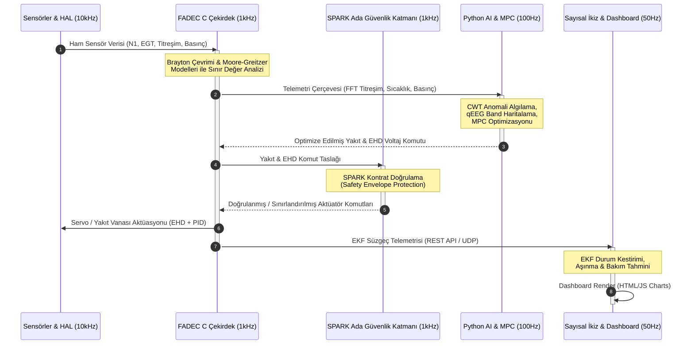

# AEGIS-TJ1 Sistem Mimari Genel Bakış (System Architecture Overview)

AEGIS-TJ1 (Advanced Engine Governance & Intelligent Systems), tek şaftlı bir turbojet motorunun yönetimi için tasarlanmış çok katmanlı, emniyet kritik ve yapay zeka destekli bir FADEC (Full Authority Digital Engine Control) sistemidir.

Bu mimari; **C Tabanlı Gerçek Zamanlı Çekirdek**, **SPARK Ada Tabanlı Güvenlik Katmanı**, **Python Tabanlı Çevrimdışı/Çevrimiçi Yapay Zeka Modelleri** ve **Web Tabanlı Sayısal İkiz Arayüzü** olmak üzere dört temel katmandan oluşur.

---

## 1. Sistem Bileşenleri ve Rolleri

### 1.1 Gerçek Zamanlı Çekirdek (C Core - MISRA C:2012)
Sistemin en alt seviyesindeki gerçek zamanlı çalışan kontrol döngüsüdür:
- **brayton_thermo**: Brayton çevrimi termodinamik verimliliği, kompresör işi, türbin işi ve spesifik itkiyi hesaplar.
- **compressor_map**: Moore-Greitzer RK4 çözücüsü yardımıyla stall ve surge limitlerini izler.
- **ehd_thrust**: Biefeld-Brown etkisini kullanarak sınır tabaka akış kontrolü ve itki/ağırlık oranı katkısını modelleyen EHD aktüatörlerini yönetir.
- **fadec_hal / fadec_control**: PID hız/sıcaklık kontrolü yapar, aktüatör sinyallerini sınırlar.
- **sensor_interface / rtos_tasks**: RTOS zamanlamasına uygun şekilde 1kHz kontrol döngüsü ve 10kHz sensör örnekleme görevlerini yürütür.
- **cyber_defense**: Z-score ve CUSUM tabanlı sızma tespiti (IDS) ve veri yolu şifrelemesini yönetir.

### 1.2 Emniyet Kritik Katman (Ada Guard - SPARK Ada 2012)
C çekirdeğinden bağımsız bir güvenlik denetleyicisidir (Safety Guard):
- **contract_validator**: FADEC çıkışlarının (yakıt akışı, servo açıları, EHD voltajı) fiziksel zarf sınırları dahilinde kalıp kalmadığını pre/post-condition kontratlarıyla doğrular.
- **ai_decision_engine**: Yapay zekanın önerdiği optimizasyon kararlarını denetler, tehlikeli kararları reddeder veya sönümler.
- **memory_safe_buffer**: Çalışma zamanında oluşabilecek bellek taşmalarını engellemek için SPARK tarafından doğrulanmış dinamik bellekten bağımsız halka tamponlar (ring buffers) sağlar.

### 1.3 Yapay Zeka ve Kontrol Modelleri (Python AI Layer)
Motor verimliliğini artıran ve bakım öngörüsünü sağlayan yapay zeka katmanıdır:
- **adaptive_mpc**: Gelişmiş doğrusal olmayan durum-uzay modeli (Nonlinear State-Space) kullanarak yakıt akışını, EHD voltajını ve stator açılarını optimize eder. AI tabanlı surge kaybı cezasını maliyet fonksiyonuna dahil eder.
- **surge_predictor**: DRL (Deep Reinforcement Learning) REINFORCE algoritması ile surge riskini önceden tespit ederek FADEC'i uyarır.
- **anomaly_detector**: CWT (Continuous Wavelet Transform) ile yüksek frekanslı titreşimleri analiz ederek Morlet wavelet yöntemiyle mikro çatlakları tespit eder.
- **health_monitor**: Sensörlerin frekans dağılımını (Welch PSD) qEEG beyin dalgaları analojisi (Delta, Theta, Alpha, Beta, Gamma) ile motor sağlığına haritalandırır.

### 1.4 Sayısal İkiz Arayüzü (Web Dashboard)
FastAPI REST API tabanlı çalışan dijital ikiz sunucusu ve görsel arayüzdür:
- Motorun gerçek zamanlı sensör telemetrilerini toplar.
- EKF (Extended Kalman Filter) vasıtasıyla rotor hızı, sıcaklık ve basıncı süzerek kompresör/türbin aşınma katsayılarını hesaplar.
- Brayton döngüsü T-s diyagramlarını, kompresör haritasını ve qEEG motor sağlık matrisini görselleştirir.

---

## 2. Çok Disiplinli Veri Akış Şeması (Data Flow Diagram)

Aşağıdaki şemada, sistem genelindeki 100Hz ila 10kHz frekans aralığındaki veri akışları gösterilmiştir:

---

## 3. Güvenlik ve Dayanıklılık Mimarisi

1. **Cyber-Defense Kontrolü**: `cyber_defense.c` modülü sensör okumaları üzerinde Z-Score ve CUSUM algoritmaları koşturarak spoofing veya jamming girişimlerini algılar. Eğer anomali tespit edilirse yedek sensör kanalına geçiş yapılır.
2. **Polimorfik Veri Yolu Şifrelemesi**: FADEC ile sayısal ikiz arasındaki telemetri hattı AES-256-GCM ile şifrelenmiştir ve `key_rotator.py` tarafından her 10 saniyede bir simetrik anahtar rotasyonu gerçekleştirilir.
3. **SPARK Ada Güvenceleri**: Motor kritik limitlerini aşmaya çalışan her türlü AI komutu, Ada tarafındaki pre-condition'lar sayesinde hardware seviyesine inmeksizin engellenir.
