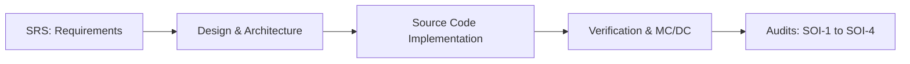

# Plan for Software Aspects of Certification (PSAC)
## Document No: AEGIS-FADEC-PSAC-001 Rev A
## Target Standard: RTCA DO-178C / EUROCAE ED-12C
## Classification: UNCLASSIFIED

---

## 1. System Overview & Scope
This document defines the Plan for Software Aspects of Certification (PSAC) for the AEGIS-TJ1 FADEC (Full Authority Digital Engine Control) software. The FADEC is responsible for controlling the fuel metering valve, stator guide vanes, and maintaining thrust schedules while enforcing turbine safety limits on a single-spool turbofan engine.

---

## 2. Software Level (DAL) Allocation
Based on the System Safety Assessment (SSA) and Failure Hazard Analysis (FHA), the FADEC software is categorized under **Software Level A (DAL-A / Design Assurance Level A)**.
* **Failure Condition Category**: Catastrophic
* Failure of the primary engine control function leads directly to loss of thrust control, overspeed, or catastrophic engine turbine explosion.
* **Assurance Objective**: Full structural coverage is required, including statement coverage, decision coverage, and **Modified Condition/Decision Coverage (MC/DC)**.

---

## 3. Software Lifecycle Process

### 3.1 Software Development Processes
1. **Requirements Specification**: High-level requirements are written using strict "shall" statements.
2. **Design & Implementation**: Core flight logic is written in Safe C++17 (no dynamic heap, no virtual dispatch, standard-layout structs).
3. **Traceability**: All code elements and verification items are trace-mapped back to individual SRS requirement IDs.

### 3.2 Verification Process
1. **Low-Level Testing (LLT)**: Verifies C/C++ individual modules (e.g. `fuel_schedule`, `vane_schedule`) using unit tests.
2. **High-Level Testing (HLT)**: Verifies complete engine/FADEC coupled loops using digital twin co-simulations.
3. **MC/DC Coverage Verification**: Enforces condition-level independence checks. Any untested branches or condition combinations must be formally justified.

---

## 4. Hardware Environment & Target Realism
* **Target Processor**: ARM Cortex-R5F Coaxial Safety Microcontroller.
* **Instruction Set Architecture (ISA)**: ARMv7-R Thumb-2 Instruction Set.
* **Compiler Target Options**:
  `-mthumb -mcpu=cortex-r5 -mfloat-abi=hard -mfpu=vfpv3-d16 -ffunction-sections -fdata-sections`
* **Real-time OS**: ARINC-653 compliant partitioning environment (VxWorks 653 or PikeOS equivalents).

---

## 5. Tool Qualification Plan (DO-330)
Tool classification and qualification rules according to RTCA DO-330:
1. **Compiler (arm-none-eabi-gcc)**: Class T3 (Software Development Tool). Compiler correctness is verified via strict comparison of disassembly output against standard test cases.
2. **Verification Suite (Pytest & ctypes)**: Class T2 (Software Verification Tool). Verified using a known baseline suite with intentionally injected errors to guarantee detection capability.
