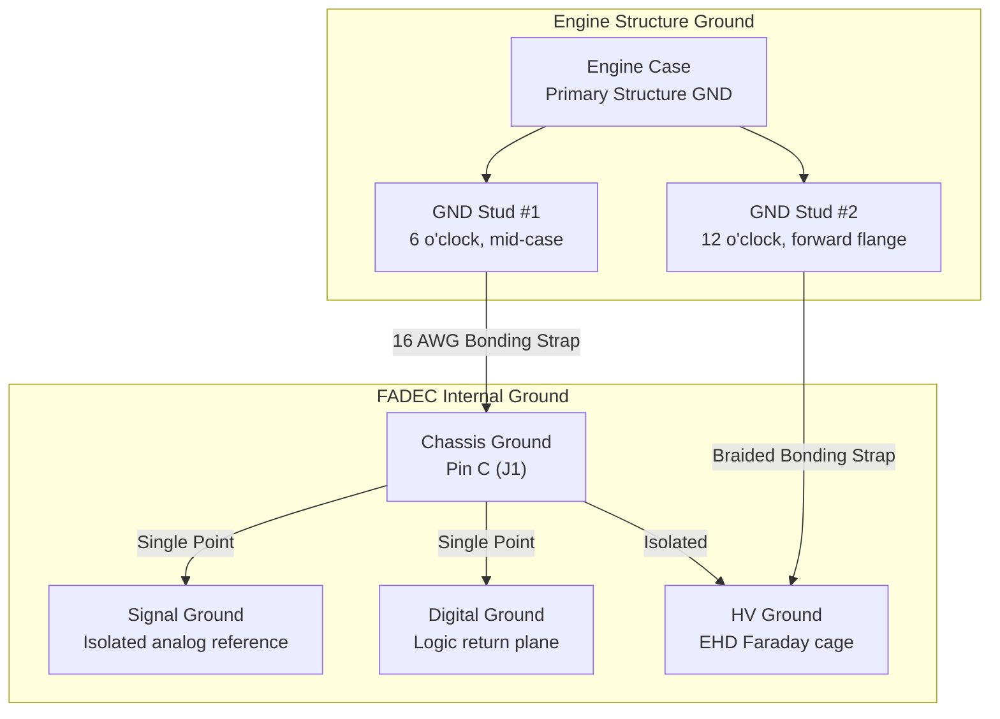
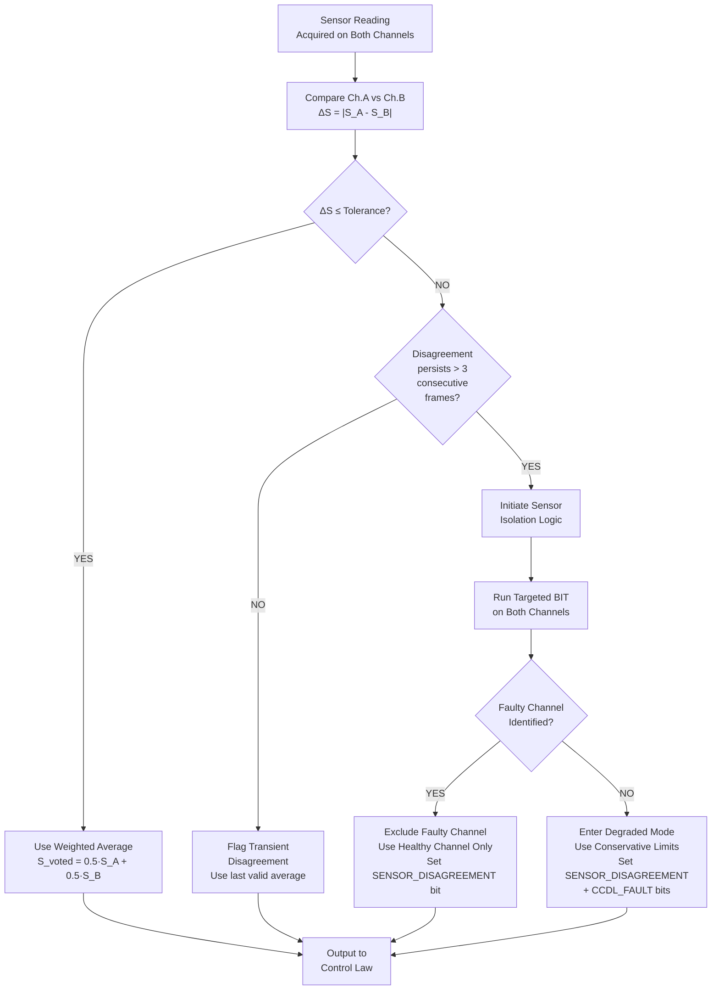
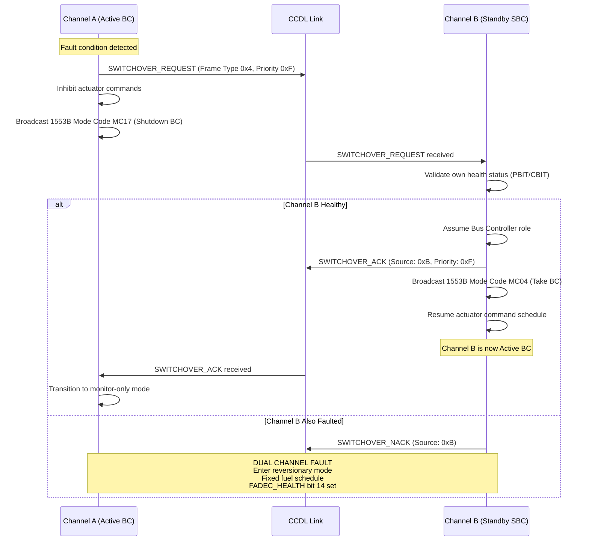

# AEGIS-TJ1 Interface Control Document (ICD)

## Document No: ICD-AEGIS-001 Rev A

| Field                  | Value                                              |
|------------------------|----------------------------------------------------|
| **Document Title**     | FADEC Data Bus Interface Control Document          |
| **Document Number**    | ICD-AEGIS-001                                      |
| **Revision**           | A                                                  |
| **Date**               | 2026-06-20                                         |
| **Classification**     | UNCLASSIFIED / FOUO                                |
| **Program**            | AEGIS-TJ1 Advanced Engine Governance & Intelligent Systems |
| **Engine Type**        | Single-Spool Turbojet with EHD Augmentation        |
| **Prepared By**        | FADEC Integration Team — Avionics & Data Bus Group |
| **Approved By**        | Chief Systems Engineer                             |
| **Applicable Standards** | MIL-STD-1553B, MIL-HDBK-1553A, ARINC 825 (CAN Aerospace), MIL-STD-461G, DO-160G, DO-178C (DAL A), DO-254 (DAL A) |

---

> [!IMPORTANT]
> This document defines the authoritative interface specification for all electrical signals, data bus protocols, connector pin assignments, and data flows between the FADEC Electronic Control Unit (ECU) and all engine-mounted line-replaceable units (LRUs). Any deviation from this ICD requires formal Engineering Change Proposal (ECP) review per the project Configuration Management Plan.

---

## Table of Contents

1. [Purpose & Scope](#1-purpose--scope)
2. [Reference Documents](#2-reference-documents)
3. [Definitions & Abbreviations](#3-definitions--abbreviations)
4. [System Architecture](#4-system-architecture)
5. [MIL-STD-1553B Signal Definition Table](#5-mil-std-1553b-signal-definition-table)
6. [CAN Aerospace (ARINC 825) Signal Definition Table](#6-can-aerospace-arinc-825-signal-definition-table)
7. [Connector Pin Assignment Tables](#7-connector-pin-assignment-tables)
8. [Bandwidth Budget Analysis](#8-bandwidth-budget-analysis)
9. [EMI/EMC Considerations](#9-emiemc-considerations)
10. [Cross-Channel Data Link (CCDL)](#10-cross-channel-data-link-ccdl)
11. [Revision History](#11-revision-history)

---

## 1. Purpose & Scope

### 1.1 Purpose

This Interface Control Document (ICD) establishes the complete and binding definition of all electrical and digital data interfaces between the AEGIS-TJ1 Full Authority Digital Engine Control (FADEC) Electronic Control Unit and the following engine-mounted subsystems:

- Engine-mounted sensors (thermocouples, RTDs, pressure transducers, magnetic pickups, accelerometers, eddy current probes)
- Electromechanical actuators (fuel metering valve, inlet guide vane servo)
- EHD (Electrohydrodynamic) plasma flow control system
- AI inference processor module
- Health monitoring and prognostic subsystem
- Aircraft-level avionics interface

### 1.2 Scope

This ICD is applicable to:

| Item                        | Description                                                                 |
|-----------------------------|-----------------------------------------------------------------------------|
| **Primary Data Bus**        | MIL-STD-1553B dual-redundant command/response data bus (Bus A & Bus B)      |
| **Secondary Data Bus**      | CAN Aerospace (ARINC 825) for non-safety-critical health monitoring data    |
| **Power Interface**         | +28 VDC MIL-STD-704F primary power and +5 VDC logic power                  |
| **Physical Connectors**     | MIL-DTL-38999 Series III and M12-8 circular connectors                      |
| **Operating Environment**   | –55 °C to +260 °C (engine-mounted), per DO-160G Categories                  |
| **EMI/EMC Compliance**      | MIL-STD-461G, RE102, CE102, RS103, CS114                                    |

### 1.3 Interface Boundaries

This document covers all interfaces at the **engine–airframe separation plane** (firewall forward). Aircraft-side avionics bus integration (ARINC 429, EBR-1553) is defined in a separate airframe ICD.

---

## 2. Reference Documents

| Document ID           | Title                                                        | Revision |
|-----------------------|--------------------------------------------------------------|----------|
| MIL-STD-1553B         | Aircraft Internal Time Division Command/Response Multiplex Data Bus | Notice 4 |
| MIL-HDBK-1553A        | Multiplex Applications Handbook                              | —        |
| ARINC 825-5           | CAN Bus General Standardization                              | 5        |
| MIL-STD-461G          | Requirements for the Control of EMI — Equipment & Subsystems | —        |
| MIL-STD-704F          | Aircraft Electric Power Characteristics                      | —        |
| MIL-DTL-38999         | Connectors, Circular, Miniature, High Density, Environment Resisting | Series III |
| DO-160G               | Environmental Conditions and Test Procedures for Airborne Equipment | —        |
| DO-178C               | Software Considerations in Airborne Systems and Equipment Certification | —        |
| DO-254                | Design Assurance Guidance for Airborne Electronic Hardware    | —        |
| SAE AS6802            | Time-Triggered Ethernet                                      | —        |
| AEGIS-SYS-001         | AEGIS-TJ1 System Requirements Document                       | B        |
| AEGIS-FADEC-002       | FADEC Software Design Document                               | A        |

---

## 3. Definitions & Abbreviations

| Abbreviation | Definition                                           |
|--------------|------------------------------------------------------|
| BC           | Bus Controller                                       |
| BIT          | Built-In Test                                        |
| CCDL         | Cross-Channel Data Link                              |
| CAN          | Controller Area Network                              |
| DAL          | Design Assurance Level (per DO-178C)                 |
| ECU          | Electronic Control Unit                              |
| EGT          | Exhaust Gas Temperature                              |
| EHD          | Electrohydrodynamic                                  |
| EMI/EMC      | Electromagnetic Interference / Compatibility         |
| FADEC        | Full Authority Digital Engine Control                |
| FMV          | Fuel Metering Valve                                  |
| FMEA         | Failure Mode and Effects Analysis                    |
| IGV          | Inlet Guide Vane                                     |
| LRU          | Line-Replaceable Unit                                |
| LVDT         | Linear Variable Differential Transformer             |
| MC/DC        | Modified Condition/Decision Coverage                 |
| qEEG         | Quantitative Electroencephalography (neuromorphic analogy) |
| RT           | Remote Terminal (MIL-STD-1553B)                      |
| RTD          | Resistance Temperature Detector                      |
| RUL          | Remaining Useful Life                                |
| RVDT         | Rotary Variable Differential Transformer             |
| SA           | Sub-Address (MIL-STD-1553B)                          |
| SBC          | Standby Bus Controller                               |
| TC           | Thermocouple                                         |
| TW           | Twisted Pair (Wire)                                  |

---

## 4. System Architecture

### 4.1 Data Bus Topology Diagram

```mermaid
graph TB
    subgraph FADEC_ECU["FADEC Electronic Control Unit"]
        direction TB
        CHA["Channel A<br/>Bus Controller (BC)<br/>ARM Cortex-R52 + FPGA"]
        CHB["Channel B<br/>Standby BC (SBC)<br/>ARM Cortex-R52 + FPGA"]
        CCDL_LINK["CCDL<br/>Cross-Channel<br/>Data Link<br/>10 Mbps LVDS"]
        CHA <--> CCDL_LINK
        CHB <--> CCDL_LINK
    end

    subgraph BUS_A["MIL-STD-1553B — BUS A"]
        direction LR
        BUS_A_LINE["Bus A Trunk Cable<br/>Twinax 78 Ω ±2%"]
    end

    subgraph BUS_B["MIL-STD-1553B — BUS B"]
        direction LR
        BUS_B_LINE["Bus B Trunk Cable<br/>Twinax 78 Ω ±2%"]
    end

    subgraph REMOTE_TERMINALS["Remote Terminal Subsystems"]
        direction TB
        RT01["RT01 — Sensor Hub<br/>Addr: 00001<br/>EGT, Pressure, Temp, N1"]
        RT02["RT02 — Actuator Hub<br/>Addr: 00010<br/>FMV, IGV Servo"]
        RT03["RT03 — EHD Controller<br/>Addr: 00011<br/>Inlet & Nozzle Plasma"]
        RT04["RT04 — AI Processor<br/>Addr: 00100<br/>Surge, Anomaly, RUL"]
        RT05["RT05 — Health Monitor<br/>Addr: 00101<br/>FADEC Status, BIT"]
    end

    subgraph CAN_BUS["CAN Aerospace Bus (ARINC 825)"]
        direction LR
        CAN_LINE["CAN 2.0B — 1 Mbps<br/>Shielded Twisted Pair"]
    end

    subgraph QEEG_SENSORS["qEEG Neuromorphic Sensor Cluster"]
        direction TB
        VIB_F["Front Bearing<br/>Accel X/Y"]
        VIB_M["Mid Spool<br/>Accel"]
        VIB_R["Rear Bearing<br/>Accel X/Y"]
        PROX_F["Front Proximity<br/>Eddy Current"]
        PROX_R["Rear Proximity<br/>Eddy Current"]
    end

    CHA -->|"BC"| BUS_A_LINE
    CHB -->|"SBC / Monitor"| BUS_A_LINE
    CHA -->|"SBC / Monitor"| BUS_B_LINE
    CHB -->|"BC"| BUS_B_LINE

    BUS_A_LINE <--> RT01
    BUS_A_LINE <--> RT02
    BUS_A_LINE <--> RT03
    BUS_A_LINE <--> RT04
    BUS_A_LINE <--> RT05

    BUS_B_LINE <--> RT01
    BUS_B_LINE <--> RT02
    BUS_B_LINE <--> RT03
    BUS_B_LINE <--> RT04
    BUS_B_LINE <--> RT05

    CHA <-->|"CAN Controller"| CAN_LINE
    CHB <-->|"CAN Controller"| CAN_LINE

    CAN_LINE <--> VIB_F
    CAN_LINE <--> VIB_M
    CAN_LINE <--> VIB_R
    CAN_LINE <--> PROX_F
    CAN_LINE <--> PROX_R
```



### 4.2 Bus Architecture Summary

| Parameter                     | MIL-STD-1553B (Primary)             | CAN Aerospace / ARINC 825 (Secondary) |
|-------------------------------|--------------------------------------|----------------------------------------|
| **Protocol**                  | Command/Response, half-duplex        | Multi-master, CSMA/CD+AMP             |
| **Data Rate**                 | 1 Mbps (Manchester II biphase)       | 1 Mbps (NRZ)                          |
| **Redundancy**                | Dual-redundant (Bus A + Bus B)       | Single bus, dual-CAN controller       |
| **Max Nodes**                 | 31 Remote Terminals                  | 127 nodes (11-bit ID)                 |
| **Word Size**                 | 16-bit data word + sync + parity     | 8-byte payload per frame              |
| **Bus Topology**              | Stub-coupled, transformer-isolated   | Linear bus, 120 Ω terminated          |
| **Cable Type**                | Twinaxial 78 Ω ±2%                  | Shielded twisted pair                  |
| **Max Stub Length**            | ≤ 6.1 m (direct-coupled)            | ≤ 0.3 m (CAN high-speed)             |
| **Criticality**               | DAL-A (safety-of-flight)            | DAL-B/C (health monitoring)            |
| **Applicable Standard**       | MIL-STD-1553B Notice 4              | ARINC 825-5 / ISO 11898              |

### 4.3 Remote Terminal Address Allocation

| RT Address (5-bit) | Binary   | Subsystem              | Location                   | Stub Length (m) |
|---------------------|----------|------------------------|----------------------------|-----------------|
| RT01                | 00001    | Sensor Hub             | Engine mid-case, 6 o'clock | 1.2             |
| RT02                | 00010    | Actuator Hub           | Accessory gearbox          | 0.8             |
| RT03                | 00011    | EHD Controller         | Inlet cowl, port side      | 2.1             |
| RT04                | 00100    | AI Processor           | FADEC enclosure, Bay 2     | 0.3             |
| RT05                | 00101    | Health Monitor         | FADEC enclosure, Bay 3     | 0.3             |
| RT31                | 11111    | Broadcast (reserved)   | —                          | —               |

---

## 5. MIL-STD-1553B Signal Definition Table

> [!NOTE]
> All signals on the MIL-STD-1553B bus are transmitted as 16-bit unsigned data words per MIL-STD-1553B. Multi-word signals (32-bit) are transmitted MSW-first (Most Significant Word in the lower word count). Signed integers use two's complement encoding. Float32 values are encoded as two consecutive Uint16 words per IEEE 754 single-precision format.

### 5.1 Speed & Position Signals

| SIG-ID   | Signal Name | Description                    | Source          | Destination | RT Addr | SubAddr | Word # | Bit Range | Data Type | Units | Range           | LSB     | Update Rate (Hz) | BW (words/s) | Criticality |
|----------|-------------|--------------------------------|-----------------|-------------|---------|---------|--------|-----------|-----------|-------|-----------------|---------|-------------------|--------------|-------------|
| SIG-001  | N1_SPEED    | Rotor shaft speed              | Mag Pickup → SC | FADEC       | RT01    | SA01    | 1–2    | [31:0]    | Uint32    | RPM   | 0 – 45 000      | 1 RPM   | 100               | 200          | DAL-A       |
| SIG-002  | N1_ACCEL    | Rotor shaft acceleration (dN1/dt) | Derived       | FADEC Int.  | RT01    | SA01    | 3–4    | [31:0]    | Int32     | RPM/s | –5 000 – +5 000 | 1 RPM/s | 50                | 100          | DAL-A       |

### 5.2 Temperature Signals

| SIG-ID   | Signal Name  | Description                        | Source                 | Destination | RT Addr | SubAddr | Word # | Bit Range | Data Type | Units | Range      | LSB    | Update Rate (Hz) | BW (words/s) | Criticality |
|----------|--------------|------------------------------------|------------------------|-------------|---------|---------|--------|-----------|-----------|-------|------------|--------|-------------------|--------------|-------------|
| SIG-003  | EGT_TC_01    | Exhaust gas thermocouple #1        | Type K TC → Sig. Cond. | FADEC       | RT01    | SA02    | 1      | [15:0]    | Int16     | K     | 300 – 1800 | 0.5 K  | 20                | 20           | DAL-A       |
| SIG-004  | EGT_TC_02    | Exhaust gas thermocouple #2        | Type K TC → Sig. Cond. | FADEC       | RT01    | SA02    | 2      | [15:0]    | Int16     | K     | 300 – 1800 | 0.5 K  | 20                | 20           | DAL-A       |
| SIG-005  | EGT_TC_03    | Exhaust gas thermocouple #3        | Type K TC → Sig. Cond. | FADEC       | RT01    | SA02    | 3      | [15:0]    | Int16     | K     | 300 – 1800 | 0.5 K  | 20                | 20           | DAL-A       |
| SIG-006  | EGT_TC_04    | Exhaust gas thermocouple #4        | Type K TC → Sig. Cond. | FADEC       | RT01    | SA02    | 4      | [15:0]    | Int16     | K     | 300 – 1800 | 0.5 K  | 20                | 20           | DAL-A       |
| SIG-007  | EGT_TC_05    | Exhaust gas thermocouple #5        | Type K TC → Sig. Cond. | FADEC       | RT01    | SA02    | 5      | [15:0]    | Int16     | K     | 300 – 1800 | 0.5 K  | 20                | 20           | DAL-A       |
| SIG-008  | EGT_TC_06    | Exhaust gas thermocouple #6        | Type K TC → Sig. Cond. | FADEC       | RT01    | SA02    | 6      | [15:0]    | Int16     | K     | 300 – 1800 | 0.5 K  | 20                | 20           | DAL-A       |
| SIG-009  | EGT_TC_07    | Exhaust gas thermocouple #7        | Type K TC → Sig. Cond. | FADEC       | RT01    | SA03    | 1      | [15:0]    | Int16     | K     | 300 – 1800 | 0.5 K  | 20                | 20           | DAL-A       |
| SIG-010  | EGT_TC_08    | Exhaust gas thermocouple #8        | Type K TC → Sig. Cond. | FADEC       | RT01    | SA03    | 2      | [15:0]    | Int16     | K     | 300 – 1800 | 0.5 K  | 20                | 20           | DAL-A       |
| SIG-011  | EGT_TC_09    | Exhaust gas thermocouple #9        | Type K TC → Sig. Cond. | FADEC       | RT01    | SA03    | 3      | [15:0]    | Int16     | K     | 300 – 1800 | 0.5 K  | 20                | 20           | DAL-A       |
| SIG-012  | EGT_TC_10    | Exhaust gas thermocouple #10       | Type K TC → Sig. Cond. | FADEC       | RT01    | SA03    | 4      | [15:0]    | Int16     | K     | 300 – 1800 | 0.5 K  | 20                | 20           | DAL-A       |
| SIG-013  | EGT_TC_11    | Exhaust gas thermocouple #11       | Type K TC → Sig. Cond. | FADEC       | RT01    | SA03    | 5      | [15:0]    | Int16     | K     | 300 – 1800 | 0.5 K  | 20                | 20           | DAL-A       |
| SIG-014  | EGT_TC_12    | Exhaust gas thermocouple #12       | Type K TC → Sig. Cond. | FADEC       | RT01    | SA03    | 6      | [15:0]    | Int16     | K     | 300 – 1800 | 0.5 K  | 20                | 20           | DAL-A       |
| SIG-015  | T3_COMP_EXIT | Compressor exit total temperature  | Pt100 RTD → Sig. Cond. | FADEC       | RT01    | SA04    | 1      | [15:0]    | Int16     | K     | 300 – 900  | 0.25 K | 50                | 50           | DAL-A       |
| SIG-016  | T2_INLET     | Engine inlet total temperature     | Pt100 RTD → Sig. Cond. | FADEC       | RT01    | SA04    | 2      | [15:0]    | Int16     | K     | 200 – 340  | 0.25 K | 10                | 10           | DAL-B       |

### 5.3 Pressure Signals

| SIG-ID   | Signal Name  | Description                        | Source                    | Destination | RT Addr | SubAddr | Word # | Bit Range | Data Type | Units | Range      | LSB      | Update Rate (Hz) | BW (words/s) | Criticality |
|----------|--------------|------------------------------------|---------------------------|-------------|---------|---------|--------|-----------|-----------|-------|------------|----------|-------------------|--------------|-------------|
| SIG-017  | P3_COMP_EXIT | Compressor discharge total pressure| Piezoresistive transducer | FADEC       | RT01    | SA05    | 1      | [15:0]    | Uint16    | kPa   | 0 – 2000   | 0.1 kPa  | 50                | 50           | DAL-A       |
| SIG-018  | P_AMB        | Ambient static pressure            | Absolute pressure sensor  | FADEC       | RT01    | SA05    | 2      | [15:0]    | Uint16    | kPa   | 10 – 110   | 0.01 kPa | 10                | 10           | DAL-B       |

### 5.4 Actuator Command & Feedback Signals

| SIG-ID   | Signal Name | Description                          | Source          | Destination   | RT Addr | SubAddr | Word # | Bit Range | Data Type | Units   | Range      | LSB    | Update Rate (Hz) | BW (words/s) | Criticality |
|----------|-------------|--------------------------------------|-----------------|---------------|---------|---------|--------|-----------|-----------|---------|------------|--------|-------------------|--------------|-------------|
| SIG-026  | FMV_CMD     | Fuel metering valve position command | FADEC           | Torque Motor  | RT02    | SA01    | 1      | [15:0]    | Int16     | %       | 0 – 100    | 0.05 % | 100               | 100          | DAL-A       |
| SIG-027  | FMV_FDBK    | Fuel metering valve LVDT feedback    | LVDT → Sig. Cond. | FADEC       | RT02    | SA01    | 2      | [15:0]    | Int16     | %       | 0 – 100    | 0.05 % | 100               | 100          | DAL-A       |
| SIG-028  | IGV_CMD     | Inlet guide vane angle command       | FADEC           | Servo Actuator| RT02    | SA02    | 1      | [15:0]    | Int16     | degrees | –5 – +45   | 0.1°   | 50                | 50           | DAL-B       |
| SIG-029  | IGV_FDBK    | Inlet guide vane RVDT feedback       | RVDT → Sig. Cond. | FADEC       | RT02    | SA02    | 2      | [15:0]    | Int16     | degrees | –5 – +45   | 0.1°   | 50                | 50           | DAL-B       |

### 5.5 EHD Plasma Flow Control Signals

| SIG-ID   | Signal Name        | Description                        | Source         | Destination    | RT Addr | SubAddr | Word # | Bit Range | Data Type | Units | Range    | LSB      | Update Rate (Hz) | BW (words/s) | Criticality |
|----------|--------------------|------------------------------------|----------------|----------------|---------|---------|--------|-----------|-----------|-------|----------|----------|-------------------|--------------|-------------|
| SIG-030  | EHD_INLET_ENABLE   | Inlet EHD actuator enable          | FADEC          | EHD Controller | RT03    | SA01    | 1      | [0]       | Discrete  | —     | ON / OFF | —        | 10                | 10           | DAL-C       |
| SIG-031  | EHD_INLET_VOLTAGE  | Inlet EHD voltage setpoint         | FADEC          | EHD Controller | RT03    | SA01    | 2      | [15:0]    | Uint16    | kV    | 0 – 30   | 0.5 kV   | 10                | 10           | DAL-C       |
| SIG-032  | EHD_INLET_CURRENT  | Inlet EHD current feedback         | EHD Controller | FADEC          | RT03    | SA02    | 1      | [15:0]    | Uint16    | mA    | 0 – 500  | 0.5 mA   | 10                | 10           | DAL-C       |
| SIG-033  | EHD_NOZZLE_ENABLE  | Nozzle EHD actuator enable         | FADEC          | EHD Controller | RT03    | SA03    | 1      | [0]       | Discrete  | —     | ON / OFF | —        | 10                | 10           | DAL-C       |
| SIG-034  | EHD_NOZZLE_VOLTAGE | Nozzle EHD voltage setpoint        | FADEC          | EHD Controller | RT03    | SA03    | 2      | [15:0]    | Uint16    | kV    | 0 – 30   | 0.5 kV   | 10                | 10           | DAL-C       |
| SIG-035  | EHD_NOZZLE_CURRENT | Nozzle EHD current feedback        | EHD Controller | FADEC          | RT03    | SA04    | 1      | [15:0]    | Uint16    | mA    | 0 – 500  | 0.5 mA   | 10                | 10           | DAL-C       |

### 5.6 AI Engine & Prognostic Signals

| SIG-ID   | Signal Name     | Description                          | Source        | Destination | RT Addr | SubAddr | Word # | Bit Range | Data Type         | Units       | Range      | LSB    | Update Rate (Hz) | BW (words/s) | Criticality |
|----------|-----------------|--------------------------------------|---------------|-------------|---------|---------|--------|-----------|-------------------|-------------|------------|--------|-------------------|--------------|-------------|
| SIG-036  | AI_SURGE_PROB   | Compressor surge probability (DRL)   | AI Processor  | FADEC       | RT04    | SA01    | 1–2    | [31:0]    | Float32 (2×Uint16)| probability | 0.0 – 1.0 | ~1e-7  | 50                | 100          | DAL-B       |
| SIG-037  | AI_ANOMALY_FLAG | Anomaly detection flag (CWT-based)   | AI Processor  | FADEC       | RT04    | SA01    | 3      | [0]       | Discrete          | —           | 0 / 1      | —      | 50                | 50           | DAL-B       |
| SIG-038  | AI_RUL_HOURS    | Remaining useful life estimate       | AI Processor  | FADEC       | RT04    | SA02    | 1      | [15:0]    | Uint16            | hours       | 0 – 50 000| 1 hr   | 1                 | 1            | DAL-C       |

### 5.7 FADEC Health & Status Signals

| SIG-ID   | Signal Name    | Description                         | Source   | Destination | RT Addr | SubAddr | Word # | Bit Range | Data Type       | Units    | Range | LSB | Update Rate (Hz) | BW (words/s) | Criticality |
|----------|----------------|-------------------------------------|----------|-------------|---------|---------|--------|-----------|-----------------|----------|-------|-----|-------------------|--------------|-------------|
| SIG-039  | FADEC_HEALTH_A | Channel A health status word        | FADEC    | Aircraft    | RT05    | SA01    | 1      | [15:0]    | Uint16 Bitfield | —        | —     | —   | 100               | 100          | DAL-A       |
| SIG-040  | FADEC_HEALTH_B | Channel B health status word        | FADEC    | Aircraft    | RT05    | SA01    | 2      | [15:0]    | Uint16 Bitfield | —        | —     | —   | 100               | 100          | DAL-A       |

#### FADEC Health Status Word Bit Definitions (SIG-039 / SIG-040)

| Bit | Name                  | State = 1                    | State = 0                |
|-----|-----------------------|------------------------------|--------------------------|
| 0   | CHANNEL_ACTIVE        | Channel is active BC         | Channel is standby SBC   |
| 1   | PROCESSOR_HEALTH      | Processor fault detected     | Processor healthy        |
| 2   | PBIT_PASS             | Power-up BIT passed          | PBIT failed              |
| 3   | IBIT_PASS             | Initiated BIT passed         | IBIT failed              |
| 4   | CBIT_PASS             | Continuous BIT passed        | CBIT failed              |
| 5   | MEMORY_FAULT          | RAM/ROM checksum fault       | Memory OK                |
| 6   | WATCHDOG_TIMEOUT      | Watchdog timer expired       | Watchdog nominal         |
| 7   | SENSOR_DISAGREEMENT   | Sensor cross-check failure   | Sensors agree            |
| 8   | ACTUATOR_FAULT        | Actuator loop fault detected | Actuators nominal        |
| 9   | OVERSPEED_WARNING     | N1 > 43 200 RPM (96%)       | N1 within limits         |
| 10  | OVERTEMP_WARNING      | EGT > 1 673 K (93% redline) | EGT within limits        |
| 11  | SURGE_DETECTED        | Compressor surge event       | No surge                 |
| 12  | EHD_FAULT             | EHD subsystem fault          | EHD nominal              |
| 13  | AI_PROCESSOR_FAULT    | AI module fault or timeout   | AI module OK             |
| 14  | CCDL_FAULT            | Cross-channel link lost      | CCDL operational         |
| 15  | SPARE                 | Reserved for future use      | Reserved                 |

---

## 6. CAN Aerospace (ARINC 825) Signal Definition Table

> [!NOTE]
> The CAN Aerospace bus carries high-bandwidth vibration and proximity data from the qEEG neuromorphic sensor cluster. These signals are DAL-B/C rated and are used for health monitoring, predictive maintenance, and the CWT-based anomaly detection pipeline. CAN frames use 29-bit extended identifiers per ARINC 825 Node Service conventions.

| SIG-ID   | Signal Name      | Description                          | Source                   | CAN ID (Hex) | DLC | Byte Offset | Data Type | Units | Range        | LSB      | Update Rate (Hz) | Msg/s   | Criticality |
|----------|------------------|--------------------------------------|--------------------------|---------------|-----|-------------|-----------|-------|--------------|----------|-------------------|---------|-------------|
| SIG-019  | VIB_FRONT_BRG_X  | Front bearing X-axis vibration       | MEMS Accelerometer       | 0x201         | 8   | [0:3]       | Float32   | g     | –50 – +50    | 0.001 g  | 10 000            | 10 000  | DAL-B       |
| SIG-020  | VIB_FRONT_BRG_Y  | Front bearing Y-axis vibration       | MEMS Accelerometer       | 0x202         | 8   | [0:3]       | Float32   | g     | –50 – +50    | 0.001 g  | 10 000            | 10 000  | DAL-B       |
| SIG-021  | VIB_MID_SPOOL    | Mid compressor spool vibration       | MEMS Accelerometer       | 0x203         | 8   | [0:3]       | Float32   | g     | –50 – +50    | 0.001 g  | 10 000            | 10 000  | DAL-B       |
| SIG-022  | VIB_REAR_BRG_X   | Rear bearing X-axis vibration        | MEMS Accelerometer       | 0x204         | 8   | [0:3]       | Float32   | g     | –50 – +50    | 0.001 g  | 10 000            | 10 000  | DAL-B       |
| SIG-023  | VIB_REAR_BRG_Y   | Rear bearing Y-axis vibration        | MEMS Accelerometer       | 0x205         | 8   | [0:3]       | Float32   | g     | –50 – +50    | 0.001 g  | 10 000            | 10 000  | DAL-B       |
| SIG-024  | PROX_FRONT       | Front bearing shaft proximity        | Eddy Current Probe       | 0x206         | 8   | [0:3]       | Float32   | μm    | 0 – 500      | 0.1 μm   | 5 000             | 5 000   | DAL-B       |
| SIG-025  | PROX_REAR        | Rear bearing shaft proximity         | Eddy Current Probe       | 0x207         | 8   | [0:3]       | Float32   | μm    | 0 – 500      | 0.1 μm   | 5 000             | 5 000   | DAL-B       |

### CAN Frame Format Detail (ARINC 825 compliant)

```
┌────────────────────────────────────────────────────────────────────────┐
│                     CAN 2.0B Extended Frame                           │
├──────────┬────────┬──────────┬────────────────────────────┬───────────┤
│   SOF    │ 29-bit │   RTR    │     Data Field (0–8 B)     │   CRC     │
│  (1 bit) │  ID    │  (1 bit) │                            │ (15 bits) │
├──────────┼────────┼──────────┼────────────────────────────┼───────────┤
│          │        │          │ Byte 0-3: Float32 (IEEE754)│           │
│          │        │          │ Byte 4-7: Timestamp (μs)   │           │
└──────────┴────────┴──────────┴────────────────────────────┴───────────┘
```

| Byte Offset | Field                  | Size   | Description                                    |
|-------------|------------------------|--------|------------------------------------------------|
| 0–3         | Measurement Value      | 4 B    | IEEE 754 single-precision float, big-endian    |
| 4–7         | Timestamp              | 4 B    | Microsecond counter from sensor power-on, Uint32 |

---

## 7. Connector Pin Assignment Tables

> [!IMPORTANT]
> All connectors are qualified to MIL-DTL-38999 Series III or M12-8 specifications. Mating torque values and environmental sealing requirements must comply with the engine installation drawing (AEGIS-DWG-300). Connector orientation keys are shown in the associated assembly drawing.

### 7.1 J1 — FADEC Primary Power & Data Bus

**Connector Type:** MIL-DTL-38999 Series III, Shell Size 17, 19-pin insert arrangement  
**Mating Connector:** Wall-mount receptacle, hermetically sealed  
**Keying:** Class A, Orientation W  
**Location:** FADEC ECU, forward face, position 1

| Pin | Signal Name            | Wire Gauge  | Wire Type                 | Color Code   | Notes                            |
|-----|------------------------|-------------|---------------------------|--------------|----------------------------------|
| A   | +28 VDC Main Power     | 16 AWG      | MIL-W-22759/34            | RED          | Primary engine power feed        |
| B   | +28 VDC Power Return   | 16 AWG      | MIL-W-22759/34            | BLK          | Power return to airframe GND     |
| C   | Chassis GND / Shield   | 16 AWG      | MIL-W-22759/34            | GRN          | Bonded to engine case GND stud   |
| D   | 1553B Bus A (+)        | 22 AWG      | Twinaxial, 78 Ω           | WHT          | Manchester II, transformer-coupled|
| E   | 1553B Bus A (–)        | 22 AWG      | Twinaxial, 78 Ω           | BLU          | Paired with Pin D               |
| F   | 1553B Bus B (+)        | 22 AWG      | Twinaxial, 78 Ω           | WHT          | Redundant bus, transformer-coupled|
| G   | 1553B Bus B (–)        | 22 AWG      | Twinaxial, 78 Ω           | ORG          | Paired with Pin F               |
| H   | CAN_H (ARINC 825)     | 22 AWG      | Shielded twisted pair      | YEL          | CAN high line                    |
| J   | CAN_L (ARINC 825)     | 22 AWG      | Shielded twisted pair      | GRN          | CAN low line                     |
| K   | CAN Shield             | 22 AWG      | Drain wire                 | BLK          | 360° shield termination          |
| L   | +5 VDC Logic Power     | 20 AWG      | MIL-W-22759/34            | VIO          | Regulated logic supply           |
| M   | +5 VDC Logic Return    | 20 AWG      | MIL-W-22759/34            | BLK/WHT      | Logic power return               |
| N   | CCDL TX+ (Ch.A→B)     | 24 AWG      | LVDS, 100 Ω differential  | WHT/RED      | Cross-channel data link TX       |
| P   | CCDL TX– (Ch.A→B)     | 24 AWG      | LVDS, 100 Ω differential  | RED          | Paired with Pin N               |
| R   | CCDL RX+ (Ch.B→A)     | 24 AWG      | LVDS, 100 Ω differential  | WHT/BLU      | Cross-channel data link RX       |
| S   | CCDL RX– (Ch.B→A)     | 24 AWG      | LVDS, 100 Ω differential  | BLU          | Paired with Pin R               |
| T   | Discrete GND Test      | 22 AWG      | MIL-W-22759/34            | WHT/GRN      | Ground test enable discrete      |
| U   | Fire Warning Loop+     | 22 AWG      | Fire-resistant, Nextel     | ORG          | Engine fire detection loop       |
| V   | Fire Warning Loop–     | 22 AWG      | Fire-resistant, Nextel     | ORG/WHT      | Return, continuity-monitored     |

### 7.2 J2 — Sensor Harness

**Connector Type:** MIL-DTL-38999 Series III, Shell Size 21, 37-pin insert arrangement  
**Mating Connector:** Jam-nut receptacle, engine-mounted  
**Keying:** Class A, Orientation X  
**Location:** Sensor junction box, engine mid-case

| Pin   | Signal Name           | Wire Gauge | Wire Type                    | Color Code  | Notes                          |
|-------|-----------------------|------------|------------------------------|-------------|--------------------------------|
| A     | N1 Mag Pickup (+)     | 22 AWG     | Shielded twisted pair        | WHT         | Magnetic speed pickup signal   |
| B     | N1 Mag Pickup (–)     | 22 AWG     | Shielded twisted pair        | BLK         | Return                        |
| C     | N1 Mag Pickup Shield  | 22 AWG     | Drain wire                   | GRN         | Shield drain                  |
| D     | EGT TC-01 (+)         | 24 AWG     | Type K extension wire        | YEL         | Chromel (+) leg               |
| E     | EGT TC-01 (–)         | 24 AWG     | Type K extension wire        | RED         | Alumel (–) leg                |
| F     | EGT TC-02 (+)         | 24 AWG     | Type K extension wire        | YEL         | Chromel (+) leg               |
| G     | EGT TC-02 (–)         | 24 AWG     | Type K extension wire        | RED         | Alumel (–) leg                |
| H     | EGT TC-03 (+)         | 24 AWG     | Type K extension wire        | YEL         |                                |
| J     | EGT TC-03 (–)         | 24 AWG     | Type K extension wire        | RED         |                                |
| K     | EGT TC-04 (+)         | 24 AWG     | Type K extension wire        | YEL         |                                |
| L     | EGT TC-04 (–)         | 24 AWG     | Type K extension wire        | RED         |                                |
| M     | EGT TC-05 (+)         | 24 AWG     | Type K extension wire        | YEL         |                                |
| N     | EGT TC-05 (–)         | 24 AWG     | Type K extension wire        | RED         |                                |
| P     | EGT TC-06 (+)         | 24 AWG     | Type K extension wire        | YEL         |                                |
| R     | EGT TC-06 (–)         | 24 AWG     | Type K extension wire        | RED         |                                |
| S     | EGT TC-07 (+)         | 24 AWG     | Type K extension wire        | YEL         |                                |
| T     | EGT TC-07 (–)         | 24 AWG     | Type K extension wire        | RED         |                                |
| U     | EGT TC-08 (+)         | 24 AWG     | Type K extension wire        | YEL         |                                |
| V     | EGT TC-08 (–)         | 24 AWG     | Type K extension wire        | RED         |                                |
| W     | EGT TC-09 (+)         | 24 AWG     | Type K extension wire        | YEL         |                                |
| X     | EGT TC-09 (–)         | 24 AWG     | Type K extension wire        | RED         |                                |
| Y     | EGT TC-10 (+)         | 24 AWG     | Type K extension wire        | YEL         |                                |
| Z     | EGT TC-10 (–)         | 24 AWG     | Type K extension wire        | RED         |                                |
| a     | EGT TC-11 (+)         | 24 AWG     | Type K extension wire        | YEL         |                                |
| b     | EGT TC-11 (–)         | 24 AWG     | Type K extension wire        | RED         |                                |
| c     | EGT TC-12 (+)         | 24 AWG     | Type K extension wire        | YEL         |                                |
| d     | EGT TC-12 (–)         | 24 AWG     | Type K extension wire        | RED         |                                |
| e     | T3 RTD Excitation (+) | 24 AWG     | 4-wire RTD cable, shielded   | WHT         | Pt100 excitation current       |
| f     | T3 RTD Excitation (–) | 24 AWG     | 4-wire RTD cable, shielded   | RED         |                                |
| g     | T3 RTD Sense (+)      | 24 AWG     | 4-wire RTD cable, shielded   | BLU         | Kelvin sense lead              |
| h     | T3 RTD Sense (–)      | 24 AWG     | 4-wire RTD cable, shielded   | GRN         |                                |
| j     | T2 RTD Excitation (+) | 24 AWG     | 4-wire RTD cable, shielded   | WHT/BLU     |                                |
| k     | T2 RTD Excitation (–) | 24 AWG     | 4-wire RTD cable, shielded   | RED/BLU     |                                |
| m     | T2 RTD Sense (+)      | 24 AWG     | 4-wire RTD cable, shielded   | BLU/WHT     |                                |
| n     | T2 RTD Sense (–)      | 24 AWG     | 4-wire RTD cable, shielded   | GRN/WHT     |                                |
| p     | P3 Pressure (+)       | 24 AWG     | Shielded twisted pair        | WHT/ORG     | Piezo excitation / signal      |
| q     | P3 Pressure (–)       | 24 AWG     | Shielded twisted pair        | BLK/ORG     |                                |
| r     | P_AMB Pressure (+)    | 24 AWG     | Shielded twisted pair        | WHT/VIO     | Absolute pressure              |
| s     | P_AMB Pressure (–)    | 24 AWG     | Shielded twisted pair        | BLK/VIO     |                                |

### 7.3 J3 — Actuator Harness

**Connector Type:** MIL-DTL-38999 Series III, Shell Size 17, 19-pin insert arrangement  
**Mating Connector:** Jam-nut receptacle, accessory gearbox  
**Keying:** Class A, Orientation Y  
**Location:** Accessory gearbox, actuator junction

| Pin | Signal Name              | Wire Gauge | Wire Type                    | Color Code  | Notes                          |
|-----|--------------------------|------------|------------------------------|-------------|--------------------------------|
| A   | FMV Torque Motor (+)     | 20 AWG     | Shielded twisted pair        | RED         | Fuel metering valve drive      |
| B   | FMV Torque Motor (–)     | 20 AWG     | Shielded twisted pair        | BLK         | Return                        |
| C   | FMV Torque Motor Shield  | 22 AWG     | Drain wire                   | GRN         | EMI shield drain              |
| D   | FMV LVDT Excitation (+)  | 24 AWG     | Shielded twisted pair        | WHT         | 10 kHz AC excitation          |
| E   | FMV LVDT Excitation (–)  | 24 AWG     | Shielded twisted pair        | BLK         |                                |
| F   | FMV LVDT Signal (+)      | 24 AWG     | Shielded twisted pair        | BLU         | Position feedback signal       |
| G   | FMV LVDT Signal (–)      | 24 AWG     | Shielded twisted pair        | GRN         |                                |
| H   | FMV LVDT Shield          | 24 AWG     | Drain wire                   | BLK/WHT     |                                |
| J   | IGV Servo +28V Power     | 18 AWG     | MIL-W-22759/34              | RED         | Servo motor power              |
| K   | IGV Servo Power Return   | 18 AWG     | MIL-W-22759/34              | BLK         |                                |
| L   | IGV Servo Cmd (+)        | 24 AWG     | Shielded twisted pair        | WHT         | PWM command, 400 Hz           |
| M   | IGV Servo Cmd (–)        | 24 AWG     | Shielded twisted pair        | BLU         |                                |
| N   | IGV RVDT Excitation (+)  | 24 AWG     | Shielded twisted pair        | WHT/RED     | 5 kHz AC excitation           |
| P   | IGV RVDT Excitation (–)  | 24 AWG     | Shielded twisted pair        | RED/BLK     |                                |
| R   | IGV RVDT Signal (+)      | 24 AWG     | Shielded twisted pair        | BLU/WHT     | Angle feedback                |
| S   | IGV RVDT Signal (–)      | 24 AWG     | Shielded twisted pair        | GRN/WHT     |                                |
| T   | IGV RVDT Shield          | 24 AWG     | Drain wire                   | BLK/GRN     |                                |
| U   | Actuator Health Discrete | 22 AWG     | MIL-W-22759/34              | YEL         | Open-collector fault discrete  |
| V   | Signal GND               | 22 AWG     | MIL-W-22759/34              | GRN         | Analog signal reference        |

### 7.4 J4 — EHD High Voltage

**Connector Type:** MIL-DTL-38999 Series III, Shell Size 13, 7-pin insert arrangement  
**Mating Connector:** Jam-nut receptacle, EHD controller box  
**Keying:** Class K (high-voltage isolation)  
**Location:** Inlet cowl, port side

> [!CAUTION]
> J4 carries high-voltage DC signals up to 30 kV. Maintenance personnel must verify EHD capacitor bank discharge (< 50 V residual) before disconnecting J4. Follow high-voltage safety procedures per AEGIS-MNT-004 Section 7.

| Pin | Signal Name              | Wire Gauge | Wire Type                       | Color Code  | Notes                             |
|-----|--------------------------|------------|---------------------------------|-------------|------------------------------------|
| A   | EHD Inlet HV (+)         | 18 AWG     | HV silicone, 30 kV rated        | RED/WHT     | Inlet electrode power, 0–30 kV    |
| B   | EHD Inlet HV Return      | 18 AWG     | HV silicone, 30 kV rated        | BLK/WHT     | Electrode return                   |
| C   | EHD Nozzle HV (+)        | 18 AWG     | HV silicone, 30 kV rated        | RED/BLU     | Nozzle electrode power, 0–30 kV   |
| D   | EHD Nozzle HV Return     | 18 AWG     | HV silicone, 30 kV rated        | BLK/BLU     | Electrode return                   |
| E   | EHD Interlock             | 22 AWG     | MIL-W-22759/34                  | YEL         | HV enable interlock discrete       |
| F   | EHD Current Monitor       | 24 AWG     | Shielded single conductor       | VIO         | 0–5 V analog, 0–500 mA mapped     |
| G   | EHD Shield / Chassis GND  | 16 AWG     | Braided shield + drain wire     | GRN         | Faraday cage bonding               |

### 7.5 J5 — qEEG Sensor Cluster

**Connector Type:** M12-8, A-coded, shielded, IP67 rated  
**Mating Connector:** Panel-mount receptacle on sensor cluster housing  
**Keying:** A-code, polarized  
**Location:** Forward bearing housing & aft bearing housing (2× J5 instances)

| Pin | Signal Name               | Wire Gauge | Wire Type                   | Color Code | Notes                            |
|-----|---------------------------|------------|-----------------------------|------------|----------------------------------|
| 1   | CAN_H (Sensor Cluster)    | 24 AWG     | Shielded twisted pair       | YEL        | CAN high, daisy-chain topology   |
| 2   | CAN_L (Sensor Cluster)    | 24 AWG     | Shielded twisted pair       | GRN        | CAN low                         |
| 3   | +12 VDC Sensor Power      | 22 AWG     | MIL-W-22759/34              | RED        | Sensor excitation power          |
| 4   | Sensor Power Return       | 22 AWG     | MIL-W-22759/34              | BLK        | Power return                    |
| 5   | Sync Pulse (1PPS)         | 24 AWG     | Coaxial, 50 Ω              | WHT        | 1 pulse-per-revolution sync      |
| 6   | Sensor Health Discrete    | 24 AWG     | MIL-W-22759/34              | BLU        | Active-low fault indicator       |
| 7   | Shield Drain              | 24 AWG     | Drain wire                  | —          | 360° shield termination          |
| 8   | Spare                     | 24 AWG     | MIL-W-22759/34              | VIO        | Reserved for future expansion    |

---

## 8. Bandwidth Budget Analysis

### 8.1 MIL-STD-1553B Bus Utilization

**Bus capacity reference:**
- Raw data rate: 1.0 Mbps (Manchester II biphase encoding)
- Effective word rate: 1 word = 20 μs (16 data bits + 3 sync + 1 parity = 20 bits @ 1 Mbps)
- Maximum throughput: **50 000 words/sec** (raw)
- Accounting for command/status overhead (~40%): **~31 250 usable data words/sec**

#### Per-Signal Word Budget

| SIG-ID        | Signal Name        | Words/Message | Update Rate (Hz) | Words/sec | Notes                         |
|---------------|--------------------|---------------|-------------------|-----------|-------------------------------|
| SIG-001       | N1_SPEED           | 2             | 100               | 200       | 32-bit, MSW first            |
| SIG-002       | N1_ACCEL           | 2             | 50                | 100       | 32-bit, derived              |
| SIG-003–008   | EGT_TC_01–06       | 6             | 20                | 120       | Packed in SA02 block         |
| SIG-009–014   | EGT_TC_07–12       | 6             | 20                | 120       | Packed in SA03 block         |
| SIG-015       | T3_COMP_EXIT       | 1             | 50                | 50        |                               |
| SIG-016       | T2_INLET           | 1             | 10                | 10        |                               |
| SIG-017       | P3_COMP_EXIT       | 1             | 50                | 50        |                               |
| SIG-018       | P_AMB              | 1             | 10                | 10        |                               |
| SIG-026       | FMV_CMD            | 1             | 100               | 100       |                               |
| SIG-027       | FMV_FDBK           | 1             | 100               | 100       |                               |
| SIG-028       | IGV_CMD            | 1             | 50                | 50        |                               |
| SIG-029       | IGV_FDBK           | 1             | 50                | 50        |                               |
| SIG-030       | EHD_INLET_ENABLE   | 1             | 10                | 10        |                               |
| SIG-031       | EHD_INLET_VOLTAGE  | 1             | 10                | 10        |                               |
| SIG-032       | EHD_INLET_CURRENT  | 1             | 10                | 10        |                               |
| SIG-033       | EHD_NOZZLE_ENABLE  | 1             | 10                | 10        |                               |
| SIG-034       | EHD_NOZZLE_VOLTAGE | 1             | 10                | 10        |                               |
| SIG-035       | EHD_NOZZLE_CURRENT | 1             | 10                | 10        |                               |
| SIG-036       | AI_SURGE_PROB      | 2             | 50                | 100       | Float32 as 2×Uint16          |
| SIG-037       | AI_ANOMALY_FLAG    | 1             | 50                | 50        |                               |
| SIG-038       | AI_RUL_HOURS       | 1             | 1                 | 1         |                               |
| SIG-039       | FADEC_HEALTH_A     | 1             | 100               | 100       |                               |
| SIG-040       | FADEC_HEALTH_B     | 1             | 100               | 100       |                               |
| —             | **TOTAL DATA**     | —             | —                 | **1 521** |                               |

#### Bus Utilization Summary

| Metric                                       | Value                    |
|----------------------------------------------|--------------------------|
| Total data words/sec                         | 1 521                    |
| Command + status overhead (2 words/transfer) | ~1 140 words/sec (est.)  |
| **Total bus words/sec (with overhead)**       | **~2 661 words/sec**     |
| Maximum usable capacity                      | 31 250 words/sec         |
| **Bus A utilization**                         | **8.5 %**                |
| Bus B utilization (mirror schedule)          | 8.5 %                    |
| Remaining capacity for growth                | 91.5 %                   |

> [!TIP]
> The 8.5% utilization provides substantial margin for future signal additions (e.g., secondary fuel system, variable area nozzle, additional AI inference outputs). Per MIL-HDBK-1553A guidance, bus utilization should remain below 80% for deterministic real-time performance.

### 8.2 CAN Aerospace Bus Utilization

**Bus capacity reference:**
- Raw data rate: 1.0 Mbps (NRZ, ISO 11898)
- CAN 2.0B extended frame: 29-bit ID, 8-byte data, ~130 bits/frame (with stuff bits)
- Maximum frame rate: ~7 700 frames/sec (theoretical)

#### Per-Signal Frame Budget

| SIG-ID        | Signal Name       | Bytes/Frame | Update Rate (Hz) | Frames/sec | Bits/sec (approx.) |
|---------------|-------------------|-------------|-------------------|------------|---------------------|
| SIG-019       | VIB_FRONT_BRG_X   | 8           | 10 000            | 10 000     | 1 300 000           |
| SIG-020       | VIB_FRONT_BRG_Y   | 8           | 10 000            | 10 000     | 1 300 000           |
| SIG-021       | VIB_MID_SPOOL     | 8           | 10 000            | 10 000     | 1 300 000           |
| SIG-022       | VIB_REAR_BRG_X    | 8           | 10 000            | 10 000     | 1 300 000           |
| SIG-023       | VIB_REAR_BRG_Y    | 8           | 10 000            | 10 000     | 1 300 000           |
| SIG-024       | PROX_FRONT        | 8           | 5 000             | 5 000      | 650 000             |
| SIG-025       | PROX_REAR         | 8           | 5 000             | 5 000      | 650 000             |
| —             | **TOTAL**         | —           | —                 | **60 000** | **7 800 000**       |

> [!WARNING]
> **CAN bus capacity exceeded.** The aggregate demand of 60 000 frames/sec (≈7.8 Mbps) vastly exceeds the CAN 2.0B capacity of ~7 700 frames/sec at 1 Mbps. The following mitigation strategies are mandatory:

#### CAN Bandwidth Mitigation Architecture

| Strategy                        | Description                                                                                                                            | Result                       |
|---------------------------------|----------------------------------------------------------------------------------------------------------------------------------------|------------------------------|
| **CAN FD Upgrade**              | Migrate to CAN FD (ISO 11898-7) at 5 Mbps data phase, 1 Mbps arbitration phase. Frame capacity increases to ~38 500 frames/sec.       | 60 000 / 38 500 = 155% → still over |
| **Multi-bus Segmentation**      | Split into 3 independent CAN FD buses: CAN-A (front bearing), CAN-B (mid spool), CAN-C (rear bearing). Each bus carries ~20 000 fr/s. | 20 000 / 38 500 = **52%** ✅ |
| **On-Node Decimation + FFT**    | Sensor nodes perform on-board 1024-pt FFT at 10 Hz, transmitting 512 spectral bins instead of 10 000 raw samples/sec per channel.      | Reduced to ~5 120 fr/s/bus   |
| **Selected Implementation**     | **Multi-bus + on-node FFT** (hybrid): Raw 10 kHz data streamed on dedicated CAN FD segments; FFT summary on main CAN bus at 10 Hz.    | **Main CAN: < 5% utilization** |

#### Revised CAN Architecture (Selected Design)

```
┌─────────────────────────────────────────────────────────┐
│              CAN Aerospace Network — Revised            │
│                                                         │
│   CAN-FD Bus A (Front Bearing)     5 Mbps              │
│   ├── VIB_FRONT_BRG_X  (10 kHz raw)                    │
│   ├── VIB_FRONT_BRG_Y  (10 kHz raw)                    │
│   └── PROX_FRONT        (5 kHz raw)                    │
│                                                         │
│   CAN-FD Bus B (Mid Spool)         5 Mbps              │
│   └── VIB_MID_SPOOL    (10 kHz raw)                    │
│                                                         │
│   CAN-FD Bus C (Rear Bearing)      5 Mbps              │
│   ├── VIB_REAR_BRG_X   (10 kHz raw)                    │
│   ├── VIB_REAR_BRG_Y   (10 kHz raw)                    │
│   └── PROX_REAR         (5 kHz raw)                    │
│                                                         │
│   CAN Summary Bus (to FADEC)       1 Mbps              │
│   └── FFT summaries @ 10 Hz (all 7 signals)            │
│       512 bins × 7 ch × 10 Hz = 35 840 words/s         │
│       → 4 480 CAN frames/s → ~58% utilization          │
└─────────────────────────────────────────────────────────┘
```

### 8.3 Aggregate System Bandwidth Summary

| Bus                    | Capacity     | Utilized      | Utilization % | Margin  |
|------------------------|-------------|---------------|---------------|---------|
| MIL-STD-1553B Bus A    | 31 250 w/s  | 2 661 w/s     | 8.5%          | 91.5%   |
| MIL-STD-1553B Bus B    | 31 250 w/s  | 2 661 w/s     | 8.5%          | 91.5%   |
| CAN-FD Bus A (Front)   | 38 500 fr/s | 20 000 fr/s   | 52%           | 48%     |
| CAN-FD Bus B (Mid)     | 38 500 fr/s | 10 000 fr/s   | 26%           | 74%     |
| CAN-FD Bus C (Rear)    | 38 500 fr/s | 20 000 fr/s   | 52%           | 48%     |
| CAN Summary Bus        | 7 700 fr/s  | 4 480 fr/s    | 58%           | 42%     |
| CCDL (Ch.A ↔ Ch.B)    | 10 Mbps     | ~2.5 Mbps     | 25%           | 75%     |

---

## 9. EMI/EMC Considerations

### 9.1 Applicable Standards

| Standard            | Test Category                        | Applicability                              |
|---------------------|--------------------------------------|--------------------------------------------|
| MIL-STD-461G CE102  | Conducted Emissions, Power Leads     | All power input lines (J1 pins A, B)       |
| MIL-STD-461G RE102  | Radiated Emissions                   | All connectors and cable harnesses         |
| MIL-STD-461G CS114  | Conducted Susceptibility, Bulk Cable | All signal cables > 0.1 m length           |
| MIL-STD-461G RS103  | Radiated Susceptibility              | FADEC enclosure and all LRUs               |
| DO-160G Section 22  | Lightning, Induced Transients        | All externally routed cables               |
| DO-160G Section 25  | Electrostatic Discharge              | All connector interfaces                    |

### 9.2 Interface Isolation Requirements

| Interface                 | Isolation Method                    | Voltage Rating | Standard Reference    |
|---------------------------|-------------------------------------|----------------|-----------------------|
| 1553B Bus A / B           | Transformer coupling (1:1.41)       | 600 V RMS      | MIL-STD-1553B §4.5.1 |
| CAN Aerospace             | Optocoupler isolation (IL717)       | 5 kV RMS       | ISO 11898-2 Annex A   |
| EHD High Voltage           | Galvanic isolation, Faraday cage    | 50 kV DC       | Custom per EHD spec   |
| CCDL (LVDS)               | Capacitive isolation (Si8642)       | 2.5 kV RMS     | IEC 60747-5-5         |
| Thermocouple inputs       | Instrumentation amp isolation       | 1.5 kV RMS     | IEC 61010-1           |
| RTD inputs (4-wire)       | Isolated excitation source          | 1.5 kV RMS     | IEC 61010-1           |
| Piezo pressure transducers | Charge amplifier w/ isolated supply | 1.5 kV RMS     | IEC 61010-1           |

### 9.3 Cable Shielding Requirements

| Cable / Harness           | Shield Type                        | Shield Coverage | Termination                                      | Drain Wire     |
|---------------------------|------------------------------------|-----------------|--------------------------------------------------|----------------|
| 1553B Twinaxial           | Braided + foil (double shield)     | ≥ 95%           | 360° backshell termination both ends             | Per bus spec    |
| CAN STP                   | Braided shield                     | ≥ 90%           | 360° backshell at connector; pigtail < 25 mm     | 22 AWG drain   |
| Thermocouple extension    | Individual foil shield per pair    | ≥ 85%           | Single-point ground at signal conditioner        | Per pair        |
| RTD 4-wire                | Overall braided shield             | ≥ 90%           | Single-point ground at FADEC                     | 24 AWG drain   |
| EHD HV cable              | Conductive silicone + braided      | ≥ 98%           | 360° termination with corona ring                | 16 AWG, bonded |
| LVDS CCDL                 | Foil + braid (double shield)       | ≥ 95%           | 360° backshell, differential 100 Ω termination   | 24 AWG drain   |

### 9.4 Lightning Protection (DO-160G Section 22)

| Component                  | Protection Device                  | Clamp Voltage  | Response Time | Location            |
|----------------------------|------------------------------------|----------------|---------------|---------------------|
| +28 VDC Power Input        | TVS diode array (bi-directional)   | 36 V           | < 1 ns        | J1 connector entry  |
| 1553B Bus A / B            | Gas discharge tube + TVS           | 28 V clamp     | < 5 ns        | Stub junction       |
| CAN H / CAN L             | ESD/TVS (PESD2CAN)                 | 24 V           | < 1 ns        | J1 connector entry  |
| Thermocouple inputs        | TVS diode (uni-directional)        | 5.0 V          | < 1 ns        | J2 connector entry  |
| EHD HV lines              | Spark gap + metal-oxide varistor   | 35 kV          | < 100 ns      | J4 connector entry  |
| CCDL LVDS                  | ESD clamp (ESD7004)                | 7.0 V          | < 1 ns        | J1 connector entry  |

### 9.5 Grounding Architecture



**Grounding Rules:**
1. Analog signal ground and digital logic ground shall connect at a **single star point** within the FADEC enclosure.
2. EHD high-voltage ground shall be **galvanically isolated** from signal ground and bonded to engine case via a dedicated bonding strap.
3. Cable shields shall be terminated at **360° backshells** — pigtail connections are prohibited for MIL-STD-1553B and CCDL cables.
4. Thermocouple shields shall be grounded at the **signal conditioner end only** (single-point ground) to prevent ground loops.

---

## 10. Cross-Channel Data Link (CCDL)

### 10.1 CCDL Physical Interface

| Parameter                   | Specification                                   |
|-----------------------------|--------------------------------------------------|
| Interface Standard          | LVDS per TIA/EIA-644                             |
| Data Rate                   | 10 Mbps, synchronous                             |
| Encoding                    | 8b/10b with CRC-32 frame check                  |
| Cable Type                  | 100 Ω shielded differential pair                 |
| Isolation                   | Capacitive isolation, 2.5 kV RMS (Si8642)        |
| Max Cable Length             | 0.5 m (internal to FADEC enclosure)              |
| Connector                   | Internal board-to-board, keyed Samtec QSH series |
| Latency                     | ≤ 10 μs per frame (128-bit payload)             |

### 10.2 CCDL Frame Format

```
┌────────────────────────────────────────────────────────────────────┐
│                    CCDL Frame — 128-bit payload                   │
├──────────┬──────────┬──────────────────────────┬──────────────────┤
│  SYNC    │  HEADER  │       DATA PAYLOAD       │    CRC-32       │
│ (16 bit) │ (16 bit) │       (64 bit)           │   (32 bit)      │
├──────────┼──────────┼──────────────────────────┼──────────────────┤
│ 0x55AA   │ See below│  Channel health + key    │ Polynomial:     │
│          │          │  sensor values           │ 0x04C11DB7      │
└──────────┴──────────┴──────────────────────────┴──────────────────┘
```

#### Header Field Definition

| Bit Range | Field          | Description                                       |
|-----------|----------------|---------------------------------------------------|
| [15:12]   | Frame Type     | 0x1=Health, 0x2=Sensor, 0x3=Voter, 0x4=Switchover|
| [11:8]    | Sequence Count | 4-bit rolling frame counter (0–15)                |
| [7:4]     | Source Channel | 0xA = Channel A, 0xB = Channel B                 |
| [3:0]     | Priority       | 0x0=Routine, 0x8=Urgent, 0xF=Emergency           |

### 10.3 Cross-Channel Sensor Voting Logic

The CCDL enables dual-channel sensor cross-checking. Each channel independently acquires all sensor signals. The active Bus Controller (BC) performs the voting algorithm before commanding actuators.

#### Sensor Disagreement Detection



#### Sensor Disagreement Tolerance Table

| Signal          | Parameter      | Tolerance (ΔS)   | Persistence Window | Action on Failure              |
|-----------------|----------------|-------------------|--------------------|--------------------------------|
| N1_SPEED        | Rotor speed    | ±100 RPM          | 3 frames (30 ms)   | Use healthy channel; alert     |
| EGT_TC_01–12    | Exhaust temp   | ±15 K             | 5 frames (250 ms)  | Use healthy channel; derate    |
| T3_COMP_EXIT    | Comp exit temp | ±10 K             | 3 frames (60 ms)   | Use healthy channel; alert     |
| P3_COMP_EXIT    | Comp pressure  | ±20 kPa           | 3 frames (60 ms)   | Use healthy channel; alert     |
| FMV_FDBK        | Valve position | ±2.0 %            | 3 frames (30 ms)   | Use healthy channel; alert     |
| IGV_FDBK        | Vane angle     | ±1.0°             | 3 frames (60 ms)   | Use healthy channel; alert     |

### 10.4 Channel Switchover Criteria

The active channel (Bus Controller) transfers control authority to the standby channel (Standby Bus Controller) when any of the following conditions are met:

| Priority | Switchover Criterion                            | Detection Method              | Switchover Time | Reversible |
|----------|--------------------------------------------------|-------------------------------|-----------------|------------|
| 1        | Active channel processor watchdog timeout        | Hardware watchdog, 50 ms      | < 20 ms         | No         |
| 2        | Active channel power supply out of tolerance     | Voltage monitor < 24 V / > 32 V | < 5 ms       | Yes        |
| 3        | Active channel PBIT/CBIT failure                 | BIT status word, Bit 2/4      | < 50 ms         | No         |
| 4        | Active channel 1553B bus controller fault        | RT no-response count > 5      | < 100 ms        | Yes        |
| 5        | Active channel memory fault (CRC mismatch)       | RAM/ROM CRC check, Bit 5      | < 20 ms         | No         |
| 6        | CCDL heartbeat loss (> 200 ms)                   | CCDL frame timeout counter    | < 250 ms        | Yes        |
| 7        | Manual ground test command via discrete          | J1 Pin T pulled low           | < 100 ms        | Yes        |

#### Switchover Sequence



### 10.5 CCDL Data Exchange Schedule

| Frame Type    | Content                                          | Rate   | Direction      |
|---------------|--------------------------------------------------|--------|----------------|
| 0x1 — Health  | Processor status, BIT results, watchdog, temps   | 100 Hz | Bidirectional  |
| 0x2 — Sensor  | N1, EGT avg, P3, T3 (voted values)              | 50 Hz  | Bidirectional  |
| 0x3 — Voter   | Disagreement flags, isolation status             | 50 Hz  | Bidirectional  |
| 0x4 — Switchover | Switchover request/ack/nack                    | On event | Bidirectional |
| 0x5 — Sync    | Frame sync, time alignment (±1 μs)              | 1000 Hz | Bidirectional |

---

## 11. Revision History

| Revision | Date       | Author                    | Description                                                  |
|----------|------------|---------------------------|--------------------------------------------------------------|
| —        | 2026-03-15 | FADEC Integration Team    | Initial draft, preliminary signal list                       |
| A        | 2026-06-20 | FADEC Integration Team    | First formal release. Complete signal definitions (SIG-001 through SIG-040), connector pinouts (J1–J5), bandwidth analysis with CAN FD mitigation, EMI/EMC requirements, CCDL protocol definition. |

---

> **END OF DOCUMENT — ICD-AEGIS-001 Rev A**
>
> Distribution: AEGIS-TJ1 Program Office, FADEC Integration Team, Avionics IPT, EHD Subsystem Lead, AI/ML Integration Lead, Quality Assurance, DER/DAR
>
> Classification: UNCLASSIFIED / FOUO
>
> © 2026 AEGIS-TJ1 Program — All Rights Reserved
