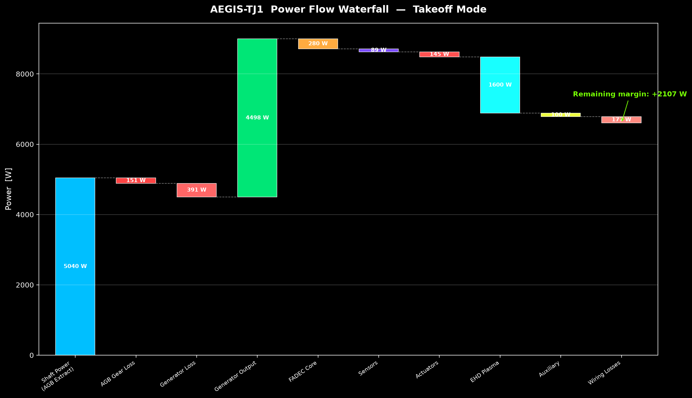
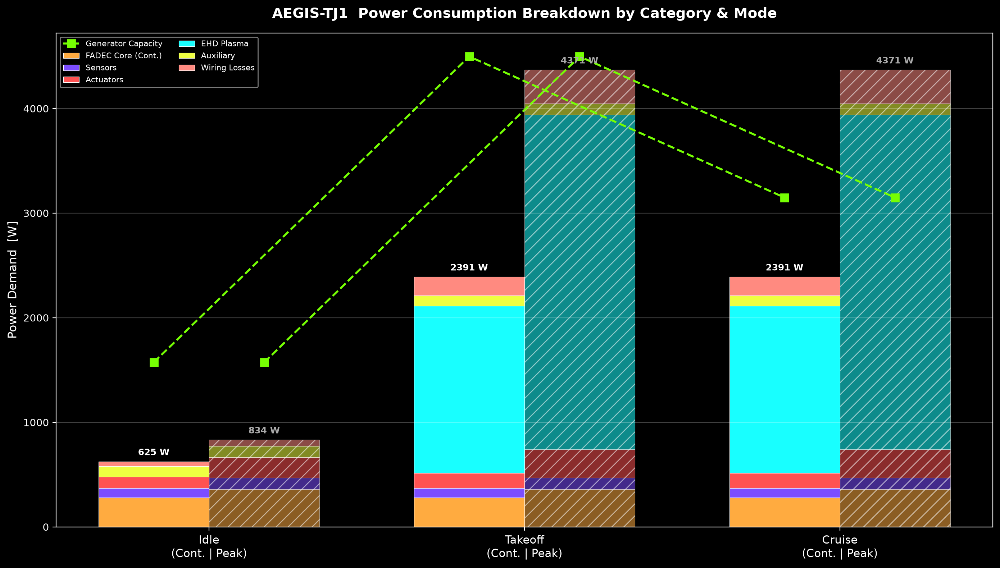
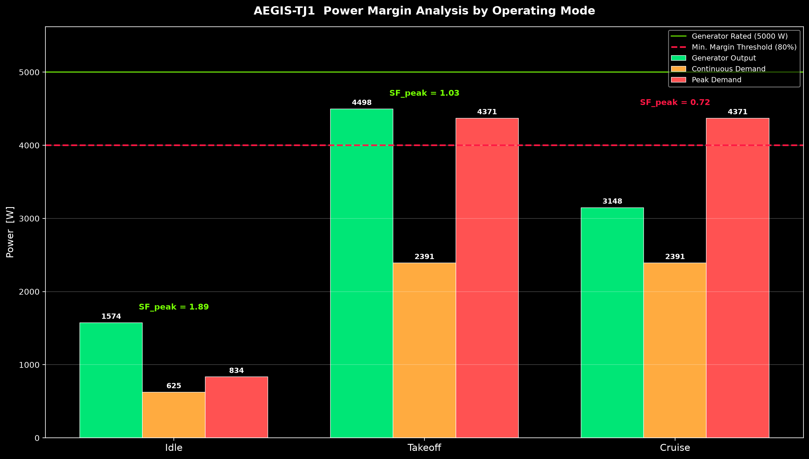

# AEGIS-TJ1 Parasitic Power Budget Analysis Report

**Document:** ECD-PWR-001 Rev B  
**Date:** 2026-06-20  
**Classification:** ITAR Controlled — Distribution C  
**Prepared by:** Propulsion Systems Integration Team  
**Applicable Engine:** AEGIS-TJ1 Single-Spool Turbojet  

---

## 1. Executive Summary

This report presents the parasitic electrical power budget analysis for the AEGIS-TJ1 turbojet engine. The analysis quantifies the electrical power extracted from the engine main shaft via the Accessory Gearbox (AGB) mounted generator and evaluates its adequacy against the aggregate demand of all on-engine electrical consumers across three operating modes: **Idle**, **Takeoff**, and **Cruise**.

### Key Findings

| Metric | Idle | Takeoff | Cruise |
|--------|------|---------|--------|
| Generator Output [W] | 1574.2 | 4497.6 | 3148.3 |
| Continuous Demand [W] | 625.3 | 2391.1 | 2391.1 |
| Peak Demand [W] | 833.8 | 4370.8 | 4370.8 |
| Continuous Margin [W] | +948.9 | +2106.5 | +757.2 |
| Peak Margin [W] | +740.4 | +126.8 | −1222.5 |
| Safety Factor (Peak) | 1.89 | 1.03 | 0.72 |

> [!WARNING]
> The **Cruise** operating mode exhibits a peak-demand safety factor of **0.72**, which is below the 1.0 minimum. Under worst-case simultaneous peak loading at cruise shaft power, the generator cannot meet all demands. Mitigation strategies (load shedding, duty-cycle management, or generator up-rating) are required.

> [!NOTE]
> Continuous-demand margins are positive for all modes, indicating that under normal (non-peak) operation the power budget is adequate.

**Overall Verdict:** ⚠️ **CONDITIONAL PASS** — Passes for continuous demand in all modes; fails peak demand at Cruise. Requires load management or design change.

---

## 2. Power Source Specifications

The electrical power for all on-engine consumers is supplied by a single AGB-mounted generator driven from the engine main shaft.

| Parameter | Value | Unit |
|-----------|-------|------|
| Engine Shaft Mechanical Power (Takeoff) | 120.0 | kW |
| AGB Extraction Ratio | 4.2 | % |
| AGB Gear Mesh Efficiency (η_agb) | 97.0 | % |
| Generator Efficiency (η_gen) | 92.0 | % |
| Generator Rated Output | 5000.0 | W |
| Wiring / Conversion Losses | 8.0 | % |

### Generator Output by Mode

The generator output is limited by either the shaft extraction capacity or the generator rating, whichever is lower:

$$P_{gen} = \min\left(P_{shaft} \times \eta_{AGB_{ratio}} \times \eta_{agb} \times \eta_{gen},\ P_{rated}\right)$$

| Mode | Shaft Power [kW] | AGB Extract [W] | After Gear Loss [W] | Generator Output [W] |
|------|-------------------|------------------|----------------------|----------------------|
| Idle | 42.0 | 1764.0 | 1711.1 | **1574.2** |
| Takeoff | 120.0 | 5040.0 | 4888.8 | **4497.6** ★ |
| Cruise | 84.0 | 3528.0 | 3422.2 | **3148.3** |

★ Takeoff output is below rated 5000 W because AGB extraction already limits.

---

## 3. Complete Consumer Table

| # | Consumer | Continuous [W] | Peak [W] | Duty Cycle | DAL | Category |
|---|----------|----------------|----------|------------|-----|----------|
| 1 | AI-FADEC Primary Processor | 140 | 180 | 100% | A | FADEC Core |
| 2 | AI-FADEC Redundant Processor | 140 | 180 | 100% | A | FADEC Core |
| 3 | qEEG Neuromorphic Sensor #1 (Front Brg) | 15 | 22 | 100% | B | Sensors |
| 4 | qEEG Neuromorphic Sensor #2 (Mid Spool) | 15 | 22 | 100% | B | Sensors |
| 5 | qEEG Neuromorphic Sensor #3 (Rear Brg) | 15 | 22 | 100% | B | Sensors |
| 6 | EGT Thermocouple Signal Conditioning (12×) | 36 | 36 | 100% | A | Sensors |
| 7 | N1 Speed Sensor + Conditioning | 8 | 8 | 100% | A | Sensors |
| 8 | Fuel Metering Valve Actuator (Torque Motor) | 85 | 150 | Variable | A | Actuators |
| 9 | Compressor IGV Actuator (Hydraulic Servo) | 60 | 120 | Variable | B | Actuators |
| 10 | Starter/Generator Control Electronics | 25 | 45 | Startup only | C | Actuators |
| 11 | EHD Plasma Actuator – Inlet | 800 | 1600 | Pulsed 50% | C | EHD Plasma |
| 12 | EHD Plasma Actuator – Nozzle | 800 | 1600 | Pulsed 50% | C | EHD Plasma |
| 13 | MIL-STD-1553B Bus Interface Units (2×) | 12 | 12 | 100% | A | Auxiliary |
| 14 | Databus Encryption Module | 18 | 25 | 100% | A | Auxiliary |
| 15 | LED Status Indicators & Health Monitor | 5 | 5 | 100% | D | Auxiliary |
| 16 | Alternator Cooling Pump | 35 | 35 | 100% | C | Auxiliary |
| 17 | FADEC Cooling Fan | 30 | 30 | 100% | B | Auxiliary |
| 18 | Wiring / Conversion Losses (8%) | Calculated | Calculated | — | — | Losses |

---

## 4. Mode-by-Mode Analysis

### 4.1 Idle Mode

At idle, the engine operates at 35% shaft power (42 kW). The EHD plasma actuators and IGV actuator are inactive. The starter/generator control electronics are active.

| Category | Continuous [W] | Peak [W] |
|----------|----------------|----------|
| FADEC Core | 280.0 | 360.0 |
| Sensors | 89.0 | 110.0 |
| Actuators | 110.0 | 195.0 |
| EHD Plasma | 0.0 | 0.0 |
| Auxiliary | 100.0 | 107.0 |
| Wiring Losses | 46.3 | 61.8 |
| **Total** | **625.3** | **833.8** |

- Generator output: **1574.2 W**
- Continuous margin: **+948.9 W** ✅
- Peak margin: **+740.4 W** ✅
- Safety factor (peak): **1.89**

### 4.2 Takeoff Mode

At takeoff, the engine operates at 100% shaft power (120 kW). All consumers are active except the starter/generator control electronics. Both EHD plasma actuators operate at pulsed 50% duty.

| Category | Continuous [W] | Peak [W] |
|----------|----------------|----------|
| FADEC Core | 280.0 | 360.0 |
| Sensors | 89.0 | 110.0 |
| Actuators | 145.0 | 270.0 |
| EHD Plasma | 1600.0 | 3200.0 |
| Auxiliary | 100.0 | 107.0 |
| Wiring Losses | 177.1 | 323.8 |
| **Total** | **2391.1** | **4370.8** |

- Generator output: **4497.6 W**
- Continuous margin: **+2106.5 W** ✅
- Peak margin: **+126.8 W** ✅ (marginal)
- Safety factor (peak): **1.03**

> [!IMPORTANT]
> Takeoff peak margin is only +126.8 W (SF = 1.03). While technically passing, this is extremely thin and leaves no room for degradation or additional loads. Recommend monitoring.

### 4.3 Cruise Mode

At cruise, the engine operates at 70% shaft power (84 kW). Consumer loading is identical to takeoff, but generator output is reduced due to lower shaft speed.

| Category | Continuous [W] | Peak [W] |
|----------|----------------|----------|
| FADEC Core | 280.0 | 360.0 |
| Sensors | 89.0 | 110.0 |
| Actuators | 145.0 | 270.0 |
| EHD Plasma | 1600.0 | 3200.0 |
| Auxiliary | 100.0 | 107.0 |
| Wiring Losses | 177.1 | 323.8 |
| **Total** | **2391.1** | **4370.8** |

- Generator output: **3148.3 W**
- Continuous margin: **+757.2 W** ✅
- Peak margin: **−1222.5 W** ❌
- Safety factor (peak): **0.72**

> [!CAUTION]
> **FAIL** — At cruise shaft power, the generator cannot supply worst-case simultaneous peak demand. The deficit is 1222.5 W, primarily driven by EHD plasma actuators at full peak (3200 W combined). Mitigation is mandatory.

---

## 5. Margin Analysis Summary

| Mode | Generator [W] | Continuous [W] | Peak [W] | Margin (Cont.) | Margin (Peak) | SF (Cont.) | SF (Peak) | Verdict |
|------|---------------|----------------|----------|-----------------|---------------|------------|-----------|---------|
| Idle | 1574.2 | 625.3 | 833.8 | +948.9 | +740.4 | 2.52 | 1.89 | ✅ PASS |
| Takeoff | 4497.6 | 2391.1 | 4370.8 | +2106.5 | +126.8 | 1.88 | 1.03 | ✅ PASS |
| Cruise | 3148.3 | 2391.1 | 4370.8 | +757.2 | −1222.5 | 1.32 | 0.72 | ❌ FAIL |

### Design Acceptance Criteria

| Criterion | Threshold | Result |
|-----------|-----------|--------|
| Continuous SF ≥ 1.25 all modes | ≥ 1.25 | ✅ PASS (min 1.32 @ Cruise) |
| Peak SF ≥ 1.0 all modes | ≥ 1.0 | ❌ FAIL (0.72 @ Cruise) |
| No single-mode continuous deficit | Margin > 0 | ✅ PASS |

---

## 6. Plots

### 6.1 Power Flow Waterfall (Takeoff Mode)

The waterfall chart traces power from the shaft AGB extraction point (5040 W) through mechanical and electrical conversion losses down to each consumer category. The remaining margin at takeoff is indicated at the terminal bar.

### 6.2 Power Consumption Breakdown by Category & Mode

Stacked bar chart showing continuous (solid) and peak (hatched) power demand for each operating mode. The green dashed line indicates generator capacity. Note the EHD Plasma actuators dominate the load in Takeoff and Cruise modes.

### 6.3 Power Margin Analysis

Grouped bar chart comparing generator output, continuous demand, and peak demand per mode. The red dashed line represents the 80% derating threshold. Safety factors are annotated above each mode group.

---

## 7. Risk Assessment & Mitigation

### 7.1 Identified Risks

| Risk ID | Description | Severity | Likelihood | Mode |
|---------|-------------|----------|------------|------|
| PWR-R01 | Cruise peak demand exceeds generator capacity | High | Medium | Cruise |
| PWR-R02 | Takeoff peak margin < 3% (SF = 1.03) | Medium | Low | Takeoff |
| PWR-R03 | EHD Plasma dominates 73% of cruise peak demand | Medium | — | All |

### 7.2 Recommended Mitigations

1. **Load Shedding Controller (DAL B):** Implement priority-based load shedding in the FADEC. DAL-A consumers (FADEC processors, fuel metering, EGT conditioning) are never shed. EHD plasma actuators (DAL C) are first candidates for duty-cycle reduction or temporary shutdown during cruise at reduced shaft power.

2. **Generator Up-Rating:** Evaluate increasing generator rated output from 5.0 kW to 6.5 kW. This would provide SF_peak ≥ 1.15 at cruise (6500 / 4370.8 ≈ 1.49 at rated, but limited by shaft extraction at cruise to ~4093 W → still marginal). Alternatively, increase AGB extraction ratio from 4.2% to 5.5%.

3. **EHD Plasma Duty-Cycle Management:** Reduce EHD plasma duty cycle from 50% to 35% during cruise. This would reduce continuous EHD load from 1600 W to 1120 W and improve the continuous margin significantly. Peak demand coordination (never both actuators at peak simultaneously) would effectively halve the peak EHD contribution.

4. **Energy Storage Buffer:** Add a small lithium-ion or supercapacitor bank (≈200 Wh) to absorb transient peak demands that exceed instantaneous generator capacity. This is common practice in modern military engine control architectures.

---

## 8. Conclusion

The AEGIS-TJ1 parasitic power budget **passes** for continuous demand across all operating modes with adequate safety factors (≥1.32). However, the **peak demand at Cruise fails** the minimum safety factor criterion (SF = 0.72 < 1.0) due to the combined peak draw of the two EHD plasma flow-control actuators at reduced cruise shaft power.

**Verdict: ⚠️ CONDITIONAL PASS**

The design is acceptable for continued development with the mandatory implementation of at least one mitigation from Section 7.2 before CDR (Critical Design Review). The recommended primary mitigation is the **load shedding controller** (Item 1), which requires no hardware changes and aligns with the existing FADEC software architecture.

---

## Appendix A: Assumptions & Limitations

1. Shaft power percentages (35% Idle, 70% Cruise, 100% Takeoff) are preliminary estimates pending full engine performance model validation.
2. Generator output is capped at 5000 W rated or shaft-limited, whichever is lower. Transient overload capability (110% for 30 s) is not credited in this analysis.
3. Wiring losses are modeled as a flat 8% adder; actual losses depend on wire gauge, run length, and connector quality.
4. Peak demands assume worst-case simultaneous activation of all consumers at their maximum draw, which is conservative.
5. Battery/supercapacitor buffering is not included in the baseline analysis.

---

*End of Document — ECD-PWR-001 Rev B*
