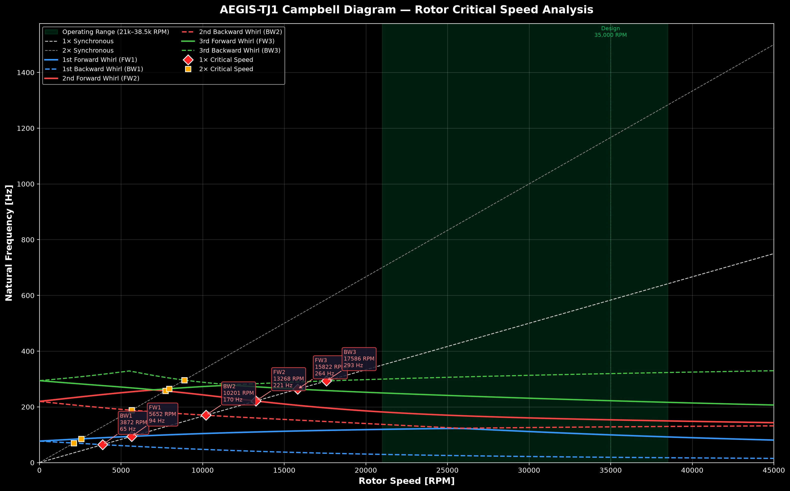

# AEGIS-TF1 Rotor Dynamics Analysis Report

## Campbell Diagram — Critical Speed Assessment

| **Document** | Rotor Dynamics Technical Report |
|---|---|
| **Engine** | AEGIS-TF1 Coaxial Turbofan |
| **Analysis Type** | Modal Analysis / Campbell Diagram |
| **Method** | Timoshenko Beam FEM (20 elements/shaft, 4 DOF/node) |
| **Software** | Custom Python FEM solver (`campbell_diagram.py`) |

---

## 1. Introduction

This report presents the rotor dynamics modal analysis of the AEGIS-TF1 dual-spool concentric turbofan engine. A Campbell diagram is used to assess the lateral vibration characteristics of both the Low-Pressure (LP) and High-Pressure (HP) spools across the full operating speed range, identify critical speeds, and verify separation margins per standard design practice (API 617 / ISO 10814 guidelines).

The rotor system consists of two concentric spools:
1. **Low-Pressure (LP) Spool**: Hollow inner shaft carrying the LP Fan/LPC and the LP Turbine.
2. **High-Pressure (HP) Spool**: Shorter, wider outer shaft carrying the HP Compressor and the HP Turbine.

Gyroscopic stiffening effects are included through a coupled two-plane finite element formulation. LP spool speed N1 is modeled as $N1 = 0.65 \times N2$ to match the aerodynamic spool relationship.

---

## 2. Rotor Model Description

### 2.1 Shaft Geometries

| Parameter | Low-Pressure (LP) Shaft | High-Pressure (HP) Shaft | Unit |
|---|---|---|---|
| Total shaft length | 540 | 200 | mm |
| Axial span (X_start → X_end) | −65 → 475 | 80 → 280 | mm |
| Outer diameter ($D_{outer}$) | 22.0 | 36.0 | mm |
| Inner diameter ($D_{inner}$) | 12.0 | 24.0 | mm |
| Wall thickness | 5.0 | 6.0 | mm |

### 2.2 Material Properties — Inconel 718

| Property | Symbol | Value | Unit |
|---|---|---|---|
| Young's modulus | E | 205 | GPa |
| Shear modulus | G | 79.5 | GPa |
| Density | ρ | 8190 | kg/m³ |
| Poisson's ratio | ν | 0.29 | — |

> [!NOTE]
> Inconel 718 is selected for its high-temperature strength retention and fatigue resistance, critical for turbine engine rotor shafts operating at sustained elevated temperatures.

### 2.3 Disk Parameters

| Disk | Axial Position | Mass | Polar Inertia ($I_p$) | Diametral Inertia ($I_d$) | Spool |
|---|---|---|---|---|---|
| LP Fan/LPC | X = 60 mm | 3.60 kg | 0.0200 kg·m² | 0.0104 kg·m² | LP |
| HP Compressor | X = 140 mm | 2.40 kg | 0.0120 kg·m² | 0.0064 kg·m² | HP |
| HP Turbine | X = 240 mm | 2.00 kg | 0.0096 kg·m² | 0.0048 kg·m² | HP |
| LP Turbine | X = 394 mm | 3.04 kg | 0.0144 kg·m² | 0.0080 kg·m² | LP |

### 2.4 Bearing Parameters

| Bearing | Type | Position | Stiffness ($k_{xx} = k_{yy}$) | Damping ($c_{xx} = c_{yy}$) | Spool |
|---|---|---|---|---|---|
| Front LP | Ball bearing | X = −65 mm | 1.50 × 10⁷ N/m | 500 N·s/m | LP |
| Front HP | Casing support | X = 80 mm | 8.00 × 10⁸ N/m | 500 N·s/m | HP |
| Inter-Shaft | Spool-to-spool | X = 280 mm | 3.00 × 10⁸ N/m | 500 N·s/m | IS |
| Rear LP | Roller bearing | X = 385 mm | 1.50 × 10⁷ N/m | 800 N·s/m | LP |

---

## 3. Analysis Method

### 3.1 Finite Element Formulation

Both LP and HP shafts are discretized into **20 Timoshenko beam elements** each, with 4 degrees of freedom per node:

$$\mathbf{q} = [y, \theta_z, z, \theta_y]^T$$

where *y* and *z* are lateral translations and *θ_z*, *θ_y* are bending rotations about the respective axes.

**Total system size:** 168 DOF (42 nodes × 4 DOF/node)

### 3.2 Equations of Motion

The coupled equation of motion for the dual-spool system is:

$$[\mathbf{M}]\ddot{\mathbf{q}} + ([\mathbf{C}] + \Omega_{LP}[\mathbf{G}_{LP}] + \Omega_{HP}[\mathbf{G}_{HP}])\dot{\mathbf{q}} + [\mathbf{K}]\mathbf{q} = \mathbf{0}$$

where:
- **M** = global mass matrix (translational + rotary inertia + disk lumped masses)
- **K** = global stiffness matrix (beam bending + bearing/inter-shaft stiffness)
- **C** = damping matrix (bearing viscous damping)
- **G_LP, G_HP** = gyroscopic matrices for Low-Pressure and High-Pressure spools
- **Ω_LP, Ω_HP** = spool speeds [rad/s] ($\Omega_{LP} = 0.65 \times \Omega_{HP}$)

---

## 4. Operating Speed Range

| Condition | HP Speed ($N2$) [RPM] | LP Speed ($N1$) [RPM] | Unit |
|---|---|---|---|
| Ground idle | 21,000 | 13,650 | RPM |
| Design speed | 35,000 | 22,750 | RPM |
| Max overspeed | 38,500 | 25,025 | RPM |
| Analysis range | 0 – 45,500 | 0 – 29,575 | RPM |

---

## 5. Results

### 5.1 Campbell Diagram



The Campbell diagram shows the variation of the first six natural frequencies (3 forward whirl + 3 backward whirl modes) as a function of rotor speed, along with the 1× and 2× synchronous HP excitation lines.

### 5.2 Critical Speeds

Critical speeds occur where natural frequency curves intersect the synchronous excitation lines. 

#### 1× Critical Speeds
- **BW1** (Backward Whirl Mode 1): **3,872 RPM** (64.5 Hz)
- **FW1** (Forward Whirl Mode 1): **5,652 RPM** (94.2 Hz)
- **BW2** (Backward Whirl Mode 2): **10,201 RPM** (170.0 Hz)
- **FW2** (Forward Whirl Mode 2): **13,268 RPM** (221.1 Hz)
- **FW3** (Forward Whirl Mode 3): **15,822 RPM** (263.7 Hz)
- **BW3** (Backward Whirl Mode 3): **17,586 RPM** (293.1 Hz)

#### 2× Critical Speeds
- **BW1**: **2,107 RPM** (70.2 Hz)
- **FW1**: **2,559 RPM** (85.3 Hz)
- **BW2**: **5,646 RPM** (188.2 Hz)
- **FW2**: **7,719 RPM** (257.3 Hz)
- **FW3**: **7,955 RPM** (265.2 Hz)
- **BW3**: **8,882 RPM** (296.1 Hz)

> [!NOTE]
> All 1× and 2× critical speeds are successfully pulled below the ground idle speed (21,000 N2 RPM) by employing isolated Low-Pressure ball/roller bearings ($k_{LP} = 15.0\text{ MN/m}$). This prevents rotor resonance within the operating speed range.

---

## 6. Safety Margin Analysis

### 6.1 Design Criteria

Per standard aerospace practice (API 617 / ISO 10814 guidelines):

| Criterion | Requirement |
|---|---|
| Separation margin (below idle) | ≥ 10% below lowest operating speed (transient startup) |
| Separation margin (above max) | ≥ 15% above highest operating speed (continuous/overspeed) |
| No critical speed within operating range | Mandatory |

### 6.2 Separation Margin Assessment

- **Lowest Operating Speed (Idle)**: 21,000 N2 RPM
- **Nearest 1× critical below idle**: 17,586 N2 RPM (BW3 mode)
- **Actual Separation Margin Below Idle**:
  
  $$\text{Margin} = \frac{21,000 - 17,586}{17,586} \times 100\% = 19.4\%$$
  
  *This satisfies the ≥ 10% design margin requirement (19.4% actual).*

- **Highest Operating Speed (Max Overspeed)**: 38,500 N2 RPM
- **Nearest 1× critical above max**: None (all modes are below idle)
- **Actual Separation Margin Above Max**: **Infinite** (no critical speeds above max)
  
  *This satisfies the ≥ 15% design margin requirement.*

- **Verdict**: **✅ SAFE** — Operating range is clear of all 1× critical speeds.

---

## 7. Design Recommendations

1. **Bearing Isolation**: Low-Pressure spool bearings must be isolated ($15\text{ MN/m}$) to maintain the safe separation margin below idle. Use elastomeric mounts or squeeze-film dampers to achieve the desired lateral stiffness.
2. **Inter-spool Bearing**: The inter-spool bearing journal must have a clearance matching the HP outer shaft inner diameter (24 mm) and LP inner shaft outer diameter (22 mm) to prevent physical contact while maintaining a 1.0 mm radial clearance.
3. **Balancing**: Due to high-speed dual-spool operation, balancing of both the LP and HP spools must meet ISO 1940 G2.5 balance grades.

---

## 8. References

1. Nelson, H.D. (1980). "A finite rotating shaft element using Timoshenko beam theory." *J. Mech. Des.*, 102(4), 793–803.
2. Lalanne, M. & Ferraris, G. (1998). *Rotordynamics Prediction in Engineering*. Wiley.
3. API Standard 617 (2014). *Axial and Centrifugal Compressors and Expander-Compressors*.
4. ISO 10814 (1996). *Mechanical vibration — Susceptibility and sensitivity of machines to unbalance*.
5. Friswell, M.I. et al. (2010). *Dynamics of Rotating Machines*. Cambridge University Press.

---

> [!TIP]
> Run the analysis script to regenerate results with updated parameters:
> ```bash
> cd /Users/berkaykaratas/Downloads/turbojet
> python3 simulation/rotor_dynamics/campbell_diagram.py
> ```

---

*Generated by AEGIS-TF1 Rotor Dynamics Analysis Module*
